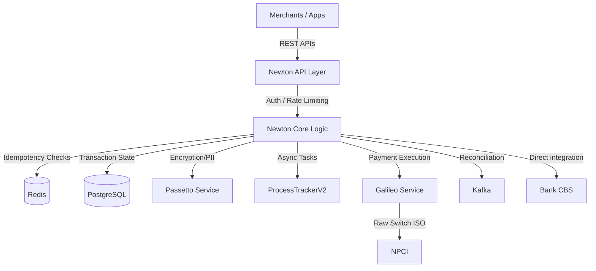
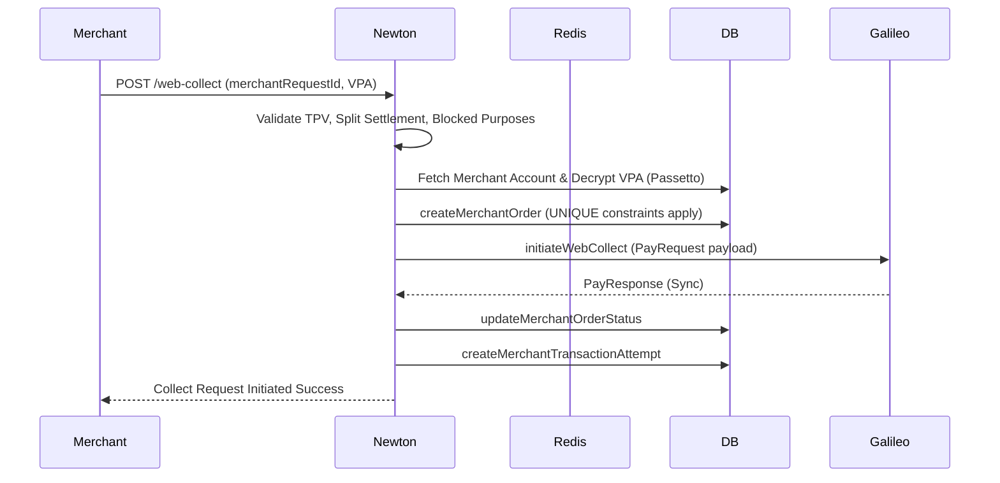
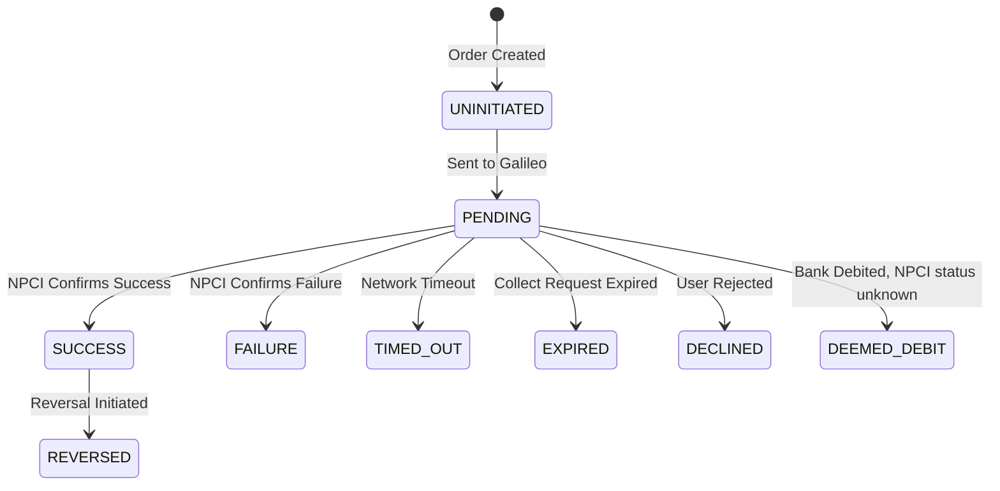

# Newton-HS Repository Analysis

This document provides a deep, comprehensive analysis of the `newton-hs` repository. It is designed to prepare you for a Senior Backend Engineering interview by extracting architectural decisions, design patterns, and actual code flows from the repository.

---

## 1. What exactly is Newton?

**Mental Model:**
Newton is a **UPI Merchant Payment Orchestration Layer**. It is deployed within the bank's infrastructure (e.g., Axis Bank, ICICI) as a standalone Haskell service. 

*   **What it does:** It sits *on top* of the core NPCI connector (Galileo). While Galileo handles raw ISO/XML messaging with the NPCI switch, Newton handles business logic: merchant authentication, mapping Merchant Orders to UPI Transactions, SDK integrations, device binding, auto-pay mandates, and asynchronous callbacks.
*   **Where it sits:** `Merchants/SDKs -> Newton -> Galileo -> NPCI Switch -> Other Banks`
*   **What it doesn't do:** Newton does *not* talk to the NPCI switch directly (that is Galileo's job). It does not handle non-UPI payments (like Credit Cards or Wallets), which are handled by another service called `EulerPS`.

---

## 2. UPI Terminology in Newton

Based on the actual codebase, here is how standard UPI terms are implemented:

*   **Galileo:** The internal Juspay service that Newton calls to interact with NPCI.
*   **P2M (Peer-to-Merchant):** Identified in the code as `P2M_PAY` or `P2M_COLLECT`. Represents a payment where the payee is a registered merchant.
*   **WebCollect / Collect:** A flow where the merchant requests money from the user's VPA. Implemented in `webCollectRoute`.
*   **Intent:** A flow where the user clicks a payment button on their phone, invoking the UPI app. Implemented in `registerIntentCoreRoute`.
*   **Mandate (AutoPay):** Recurring payments. Handled extensively in `Mandates`, `MandateHistories`, and `MandateNotificationStatuses` tables.
*   **Device Binding:** Security mechanism to ensure the request comes from the registered device. Checked via `BL.isValidDeviceFingerPrint`.
*   **upiRequestId:** The unique identifier generated for the transaction on the UPI network.
*   **merchantRequestId:** The idempotency key and order ID provided by the merchant.
*   **Deemed / Deemed Debit:** A state (`DEEMED_DEBIT`) where Newton assumes the user's account was debited, but final status from NPCI is unknown, requiring reconciliation.
*   **Passetto:** An internal encryption service used by Newton to encrypt/tokenize PII (like VPAs and Account Numbers) before storing them in the DB.

---

## 3. Repository Architecture

The repository is written in **Haskell** (using the `EulerHS` framework). 

### Major Modules (`src/Newton/`)
1.  **`App/`:** HTTP entry points, Middlewares (Rate Limiters, Authentication).
2.  **`Product/`:** Core business logic for APIs (e.g., `MerchantTransactionsV2.hs`, `MandateV2.hs`).
3.  **`Services/`:** Infrastructure wrappers: `Idempotency.hs`, `Kafka/`, `DBSync/`.
4.  **`External/`:** Clients for calling outside systems (`Galileo/`, `NPCI/`, `ProcessTrackerV2/`, `CBS/`).
5.  **`Storage/`:** Database layer containing raw SQL and ORM-like queries (`QueriesMiddleware/`).

### High-Level Architecture


---

## 4. Tracing the Request Flows

### Flow 1: Web Collect (P2M)
**Initiated by:** Merchant API (`webCollectRoute` in `MerchantTransactionsV2.hs`)



### Flow 2: Collect Approve/Decline (User Action)
**Initiated by:** User via SDK/App (`collectApproveDeclineRoute`)

1.  **Race Condition Protection:** Uses Redis `collectLock` via `UR.setCheckCollectLockInRedis` using `upiRequestId` to ensure a user cannot double-click "Approve".
2.  **Validation:** Validates `deviceFingerPrint`.
3.  **Execution:** If `APPROVE`, calls `initiateCollectPayFromWrapper`.
4.  **Async Status:** Uses `L.forkFlow'` to trigger a background job to poll/send callbacks without blocking the user response.

---

## 5. Transaction Lifecycle & Database Design

Newton maps the merchant's view (Order) to the UPI network's view (Transaction).

### Core Tables:
*   **`MerchantOrders`**: Tracks the Merchant's intent. Indexed uniquely on `(merchantRequestId, MerchantId)`.
    *   States: `UNINITIATED`, `PENDING`, `SUCCESS`, `FAILURE`, `RETRIABLE_FAILURE`.
*   **`Transactions`**: Tracks the actual UPI network request. Uniquely constrained on `(upiRequestId, role)`.
    *   States: `UNINITIATED`, `PENDING`, `SUCCESS`, `FAILURE`, `EXPIRED`, `DECLINED`, `TIMED_OUT`, `REVERSED`, `DEEMED_DEBIT`.
*   **`Refunds` & `RefundTransactions`**: Distinct tables for processing reversals.

### Transaction Lifecycle

*Why `DEEMED_DEBIT`?* In UPI, if the remitter bank debits the user but the network request times out before reaching the payee, the transaction enters a gray area. Newton marks this `DEEMED_DEBIT` to trigger aggressive reconciliation/refund logic.

---

## 6. Failure Handling

1.  **Network Timeouts to NPCI:** 
    *   If Galileo times out (`response.timeout == True`), Newton returns a 200 HTTP response but sets the internal status to `PENDING` or throws a specific `serviceUnavailable` error to the merchant.
2.  **Background Polling (SyncPending):**
    *   Transactions stuck in `PENDING` are picked up by `SyncPending.hs`. It checks `isValidStatusCheckRequest` (rate limits to prevent spamming NPCI) and calls Galileo for `galileoTxnStatus`.
3.  **Callback Retries:** 
    *   Handled entirely by delegating to `ProcessTrackerV2`.
4.  **Fail-safe Counters:** 
    *   Uses Redis and DB counters to track execution attempts for Mandates.

---

## 7. Idempotency & Duplicate Transactions

Newton enforces idempotency at **two levels**:

1.  **Short-term Caching (Redis):** (`Newton.Services.Idempotency`)
    *   Uses header `x-idempotent-id` + SDK Request ID.
    *   Sets state in Redis to `PROCESSING`. If a duplicate arrives, it returns `HTTP 202 (Request is processing)`.
    *   Once done, sets state to `PROCESSED` and caches the HTTP response JSON. If a duplicate arrives, it immediately returns the cached response.
    *   *Why?* Prevents load on the DB and Galileo for rapid-fire button clicks or immediate network retries from the SDK.
2.  **Long-term Persistence (DB Constraints):** 
    *   `MerchantOrders` has a `UNIQUE ("merchantRequestId", "MerchantId")` constraint.
    *   *Why?* If Redis evicts the key or crashes, the DB hard-prevents the creation of a duplicate order, causing a DB constraint violation which Newton catches and handles as a duplicate request.

---

## 8. Concurrency and Race Conditions

*   **The Problem:** A user clicks "Approve" twice on a Collect request simultaneously, bypassing the UI block.
*   **The Solution (`UR.setCheckCollectLockInRedis`):** Newton sets a Redis lock using the `upiRequestId`.
    ```haskell
    isCollectLockSuccess <- UR.setCheckCollectLockInRedis mId upiRequestId localTime ttlForCollectLock
    when (not isCollectLockSuccess) $ throwException transactionPendingStatus
    ```
*   **The Problem:** Simultaneous Mandate Executions.
*   **The Solution:** Similar locking mechanisms, combined with strict DB state transitions ensuring a mandate cannot move from `PENDING` to `SUCCESS` twice.

---

## 9. Async Processing

Newton heavily relies on two asynchronous systems:

1.  **ProcessTrackerV2 (`Newton.External.ProcessTrackerV2`):**
    *   An internal job queue API.
    *   Used for: Firing webhooks (`addCallbackJobToProcessTracker`), retrying SMS notifications (`addSmsRetryJobToProcessTracker`), and scheduling mandate execution checks.
    *   *Why?* Isolates HTTP request threads from slow I/O bound operations (like calling a slow merchant webhook).
2.  **Kafka (`Newton.Services.Kafka.Producer`):**
    *   Used for syncing data to the Data & Reconciliation (Recon) platform.
    *   *Why?* Recon requires a firehose of all transaction states. Writing this to Postgres sequentially would kill DB throughput. Kafka allows async, high-throughput ingestion.

---

## 10. Security

1.  **Device Binding (`SD.Device`):** SDK flows validate the device `fingerprint` and `ssid` against the registered user device in the DB.
2.  **PII Encryption (Passetto):** Newton does not store raw Account Numbers or VPAs in plaintext. It uses `Passetto` (an internal vault) to encrypt them. 
    *   *Code Evidence:* `decryptedTxnP2MStatusObject <- PT.decrypt txnP2MStatusObject isPassettoEnabled`.
3.  **Authentication:** Uses standard HMAC Checksums and Merchant Payload Signatures (`Newton.App.Middlewares.Authentication.MerchantSignatureVerificationV2`).

---

## 11. Interview Preparation Questions

### Q1: "How do you ensure we never charge a user twice for the same merchant order?"
**What they are testing:** Idempotency, Distributed locks, DB constraints.
**Strong Answer:** "Newton uses a two-layered defense. First, a Redis-based idempotency layer intercepts requests based on `x-idempotent-id` and caches states (`PROCESSING` / `PROCESSED`), returning a 202 or cached response immediately to absorb rapid retries. Second, at the persistence layer, `MerchantOrders` has a composite unique constraint on `merchantRequestId` and `MerchantId`. If Redis goes down, the database constraint serves as the ultimate source of truth, raising an exception that Newton catches and maps to a 'Duplicate Request' error."

### Q2: "What happens if Galileo (NPCI) returns a success, but Newton crashes before updating the Postgres database?"
**What they are testing:** Reconciliation and failure recovery.
**Strong Answer:** "This leads to an inconsistent state where the money moved, but Newton thinks the order is `PENDING`. Newton handles this asynchronously. Background cron jobs (like `SyncPendingTxnServiceRoute`) routinely poll Postgres for transactions stuck in the `PENDING` state past a certain threshold. It takes those `upiRequestIds` and calls Galileo's status check API. Once it discovers the `SUCCESS` state, it updates the Newton DB and triggers `ProcessTrackerV2` to fire the delayed callback to the merchant."

### Q3: "Why use ProcessTrackerV2 for callbacks instead of just sending them from the API request thread?"
**What they are testing:** Async architecture, thread pool management.
**Strong Answer:** "Merchant webhook servers are notoriously slow or unreliable. If we dispatched HTTP callbacks inline during the transaction flow, Newton's HTTP threads would block waiting for the merchant to respond. Under high load, this would exhaust Newton's connection pools and crash the API. By offloading callbacks to `ProcessTrackerV2`, Newton returns a fast response to the app, and the Process Tracker handles the exponential backoff, retries, and network delays independently."

---

## 12. Connecting to Your Experience (Breeze / Supermoney)

When discussing Newton, draw parallels honestly:

*   *"In Newton, you use `ProcessTrackerV2` for offloading callbacks and SMS retries. On Supermoney/Breeze, I dealt with exact same issues regarding external API failures, where we used [SQS/Kafka/Background Workers] to decouple slow merchant webhooks from the main transaction thread."*
*   *"I noticed Newton relies on Redis for `collectLock` to prevent race conditions when a user double-clicks approve. I've solved identical concurrency issues in distributed checkouts by utilizing Redis distributed locks and optimistic database locking to guarantee state consistency."*
*   *"Newton's `SyncPending` reconciliation flow is a classic distributed systems pattern. I have extensive experience building similar reconciliation cron jobs that sweep stuck database rows, poll upstream providers, and rectify inconsistent payment states."*
