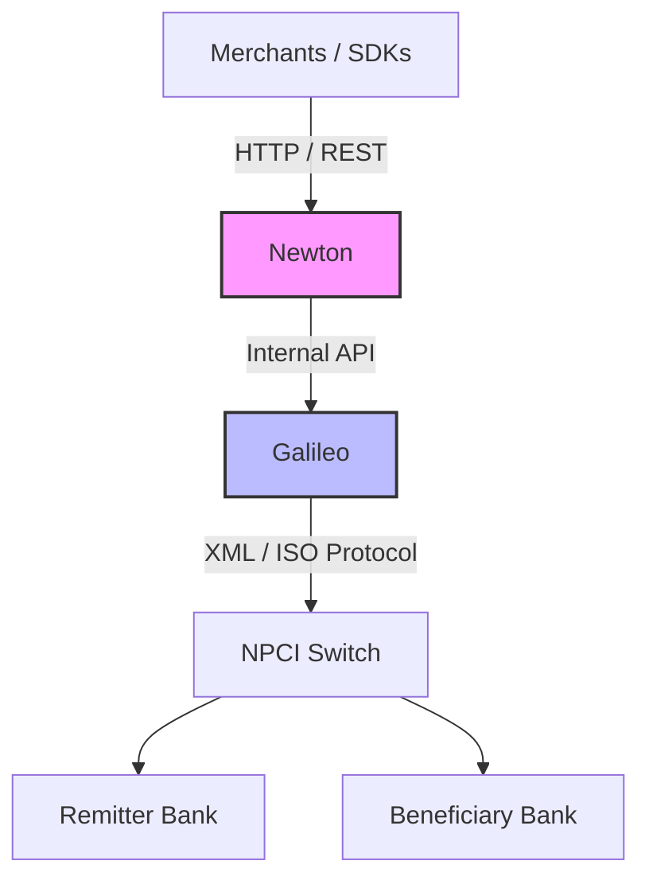
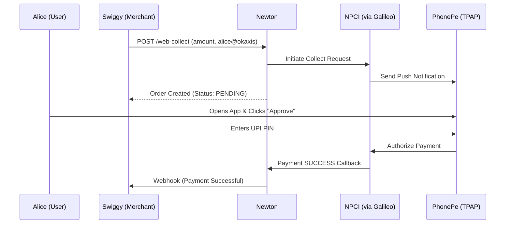
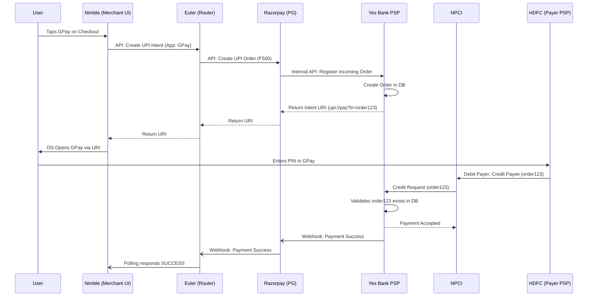
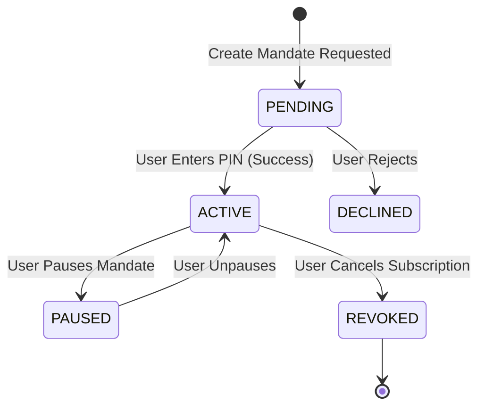

# UPI Ecosystem Fundamentals: A Primer for Backend Engineers

Before diving into the code, it is absolutely critical to understand the architecture of the Unified Payments Interface (UPI) ecosystem. Once you understand the actors, the rules, and the problems they face, the code in repositories like Newton will make perfect sense.

---

## 1. The Core Entities in UPI

UPI is a highly regulated, distributed network. It is not a single database; it is a communication protocol that allows money to move between banks instantly. 

Here are the key players:

*   **NPCI (National Payments Corporation of India):** The central governing body. They operate the **UPI Switch**, which acts as the central router for all UPI messages in India. Every single UPI transaction passes through NPCI.
*   **Remitter Bank (Payer Bank):** The bank where the person sending the money holds their account. They actually debit the money.
*   **Beneficiary Bank (Payee Bank):** The bank where the person receiving the money holds their account. They credit the money.
*   **PSP (Payment Service Provider):** A bank that connects directly to the NPCI switch to process transactions (e.g., Axis Bank, HDFC Bank, ICICI Bank). 
*   **TPAP (Third-Party Application Provider):** Consumer apps like Google Pay, PhonePe, or Cred. They **cannot** connect to NPCI directly. They must partner with a PSP Bank (which is why your Google Pay UPI ID ends in `@okaxis` or `@okhdfcbank`).

---

## 2. Where Does Juspay (Newton & Galileo) Fit?

Banks are traditionally slow at building high-throughput, modern APIs. Juspay provides the software infrastructure that **runs inside the PSP Banks** (like Axis Bank or Yes Bank) to handle UPI traffic at massive scale.

Juspay divides this responsibility into two main systems:

### 1. Galileo (The Switch Connector)
*   **What it does:** It speaks the raw, highly complex XML/ISO protocols required by the NPCI Switch.
*   **Why it exists:** NPCI's API is difficult to work with. Galileo abstracts away the NPCI networking, encryption, and raw messaging, exposing a cleaner REST/JSON API to internal services. 
*   *Analogy:* Galileo is the network card of the UPI system.

### 2. Newton (The Merchant Orchestrator)
*   **What it does:** It sits *on top* of Galileo. While Galileo just blindly routes messages, Newton adds the "business logic" required by modern merchants (like Amazon, Swiggy, or Uber).
*   **Why it exists:** Merchants don't just want to "send money." They need SDK authentication, order linking, idempotency (preventing double charges), webhook callbacks when a payment succeeds, refund management, and AutoPay scheduling. Newton handles all of this.
*   *Analogy:* Newton is the operating system running on top of Galileo.

---

## 3. Core UPI Payment Flows

### A. P2P (Peer-to-Peer)
*   **What it is:** Alice sends ₹500 to Bob (e.g., `alice@okaxis` to `bob@okhdfcbank`).
*   **How it works:**
    1. Alice opens PhonePe (TPAP) and enters Bob's VPA.
    2. PhonePe calls Axis Bank's PSP system (powered by Juspay).
    3. PSP asks NPCI to resolve Bob's VPA.
    4. Alice enters her UPI PIN. The PSP sends a **Pay Request** to NPCI.
    5. NPCI routes the debit request to Alice's bank and the credit request to Bob's bank.

### B. P2M (Peer-to-Merchant)
*   **What it is:** Alice buys a shirt on Myntra (e.g., Alice pays `myntra@okicici`).
*   **Why it's different:** Merchants have special rules. They pay MDR (Merchant Discount Rate), they have high limits, and they need instant programmatic callbacks (webhooks) so they can show a "Payment Successful" screen. Newton specializes in P2M.

### C. The "Collect" Flow vs. "Intent" Flow
These are the two main ways a P2M transaction happens:

#### 1. Collect Flow (e.g., Swiggy desktop checkout)
*   You enter your VPA (`alice@okaxis`) on Swiggy's website.
*   Swiggy's server calls Newton: *"Ask Alice for ₹500."*
*   Newton creates a **MerchantOrder** and calls Galileo -> NPCI.
*   NPCI routes a notification to Alice's PhonePe app. 
*   Alice opens the app, sees the request, and clicks "Approve". 
*   *Note: This flow is prone to timeouts if Alice takes too long, which is why Newton uses Redis locks to ensure she can't click "Approve" twice simultaneously.*

#### 2. Intent Flow (e.g., Swiggy mobile app checkout)
*   You click "Pay with UPI" inside the Swiggy mobile app.
*   Instead of asking for your VPA, Swiggy generates an "Intent URI" (e.g., `upi://pay?pa=myntra@okicici&am=500`).
*   Your phone OS detects this URI and opens your installed UPI apps (GPay, PhonePe) directly with the amount pre-filled.
*   *Why it's better:* No typing VPAs, no waiting for notifications. It is faster and has a higher success rate.

**The Payment Gateway (Aggregator) Intent Flow**
When a merchant uses an aggregator like Juspay (Euler) and a Payment Gateway (like Razorpay), the architecture is extended. The PG handles the routing and the PSP handles the banking layer.

### D. QR Code Flow
*   **Dynamic QR:** Swiggy generates a QR code on the delivery box. The QR contains the exact amount and order ID. (Works exactly like the Intent flow when scanned).
*   **Static QR:** The printed QR code at a local shop. It only contains the merchant's VPA. The user has to manually enter the amount.

### E. Autopay (Mandates)
*   **What it is:** Subscription payments (e.g., Netflix billing you ₹199 every month automatically).
*   **How it works in UPI:**
    1. **Create:** Netflix asks Newton to create a Mandate. User enters their UPI PIN *once* to authorize the recurring schedule.
    2. **Pre-Debit Notification (Notify):** RBI rules dictate the user must be notified 24 hours before a deduction. Newton calls NPCI to send this SMS.
    3. **Execute:** 24 hours later, Newton executes the mandate. Money is deducted *without* the user entering their UPI PIN.
    4. **Pause/Revoke:** The user can pause or cancel the subscription from their UPI app at any time.

---

## 4. The Hard Engineering Problems in UPI (Why Newton Exists)

If UPI is just APIs, why is it so complicated? Because networks fail, databases crash, and money is involved.

### Problem 1: The "Double Charge" (Idempotency)
*   **Scenario:** A user is on Swiggy and clicks "Pay with UPI". Their internet is slow, so the Swiggy app thinks the request failed and automatically retries. Swiggy's server ends up sending the *exact same* payment request to Newton twice.
*   **The Risk:** If Newton isn't smart, it will create two separate payment orders. The user will receive two separate UPI notifications on their PhonePe app for the same Swiggy order. They might accidentally pay both, resulting in a double charge!
*   **Solution (Idempotency):** The system must guarantee the exact same order is only processed once. Newton uses the `merchantRequestId` (Swiggy's Order ID). When the second request arrives, Newton checks Redis/Postgres, sees the ID already exists, and gracefully absorbs the duplicate request by returning the status of the first one.

### Problem 2: The "Deemed Debit" (Inconsistent State)
*   **Scenario:** Alice pays Swiggy. Alice's bank debits her account. However, before the network can credit Swiggy's bank, the NPCI switch crashes. 
*   **The Result:** Alice's money is gone, but Swiggy says "Payment Failed." This is a regulatory nightmare.
*   **Solution (Reconciliation):** This state is called a **Deemed Debit**. Newton handles this by running background jobs (like `SyncPending`). If a transaction is stuck in `PENDING` for too long, Newton actively polls Galileo for the final status. If it was a failure but the user was debited, Newton triggers an automated refund process.

### Problem 3: Slow Merchants (Async Processing)
*   **Scenario:** Alice pays Swiggy successfully. Newton needs to tell Swiggy's servers (via webhook) that the payment succeeded. But Swiggy's servers are under heavy load and take 10 seconds to respond.
*   **Solution:** Newton cannot wait 10 seconds, or it will run out of HTTP threads. Instead, Newton uses a background queue (`ProcessTrackerV2`). It drops the webhook task into the queue and immediately returns a fast response to the user. The queue handles retrying the webhook if Swiggy is down.

---

## 5. Summary Mental Model

When you look at the `newton-hs` codebase, keep this architecture in mind:

1.  **Merchant -> Newton:** The REST API where merchants create Orders and Mandates.
2.  **Newton -> Galileo:** The internal gRPC/HTTP call to initiate the raw UPI request.
3.  **Newton DB (Postgres):** Where Newton maps the Merchant's `orderId` to NPCI's `upiRequestId`.
4.  **ProcessTrackerV2 (Queue):** The background worker that handles SMS retries, webhooks, and delayed status checks.
5.  **Passetto:** The security vault so VPA addresses and account numbers aren't stored in plaintext.

By understanding this foundation, you understand the *purpose* behind the code. The code is simply the implementation of these safety mechanisms and flows.
