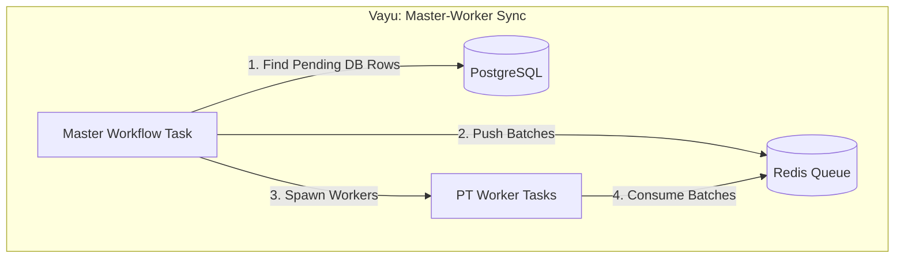
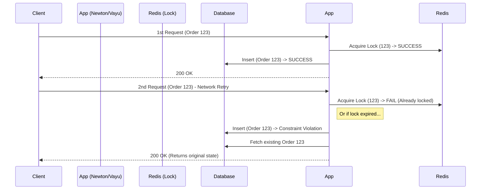
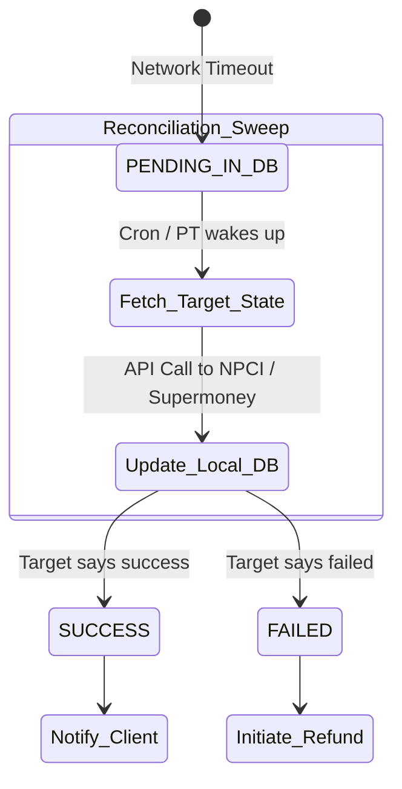

# Architectural Comparison: Newton vs. Vayu

Although `newton-hs` (UPI PSP Orchestration) and `Vayu` (E-commerce / Wallet integrations like Supermoney) serve different business domains, their core architectures share identical design philosophies for solving distributed systems problems. 

This document explores the deep similarities in how both Haskell repositories handle asynchronous jobs (**Process Tracker**), maintain consistency (**Idempotency**), and reconcile state (**Transaction Syncing**).

---

## 1. Process Tracker (PT): The Async Orchestrator

In both repositories, the core HTTP API threads must remain fast and unblocked. Any task that involves waiting on a slow external network, retrying upon failure, or scheduling for the future is immediately delegated to the **Process Tracker**.

### How it is used in Newton
In Newton, `ProcessTrackerV2` is an **external microservice**. Newton makes an API call to add jobs to it.
*   **Use Cases:** Firing webhooks to slow merchants, retrying failed SMS notifications, or scheduling mandate execution checks (24 hours in the future).
*   **Mechanism:** `addCallbackJobToProcessTracker` serializes the payload, attaches a `_processType`, and hands it off.

### How it is used in Vayu
In Vayu, Process Tracker is an **embedded internal queue system** built directly into the database and application logic (`Vayu.Product.ProcessTracker.Main`).
*   **Use Cases:** E-commerce abandoned checkout workflows, order status verification, and executing agentic loop tasks (like the `SUPERMONEY_SYNC_WORKER`).
*   **Mechanism:** Vayu creates a record in the `ProcessTracker` database table containing a `RunnerEnum` (the job type), a `_scheduleTime`, and JSON `_trackingData`. Background runners pick up these rows based on the schedule time.

### The Similarity: The Master-Worker Pattern
Both systems use PT to implement the Master-Worker pattern. Look at Vayu's Supermoney sync (which is mirrored conceptually in Newton's recon loops):

---

## 2. Idempotency: Defeating Duplicate Requests

In distributed payments, duplicate requests (from slow networks or double-clicks) are inevitable. Both systems enforce idempotency using a two-layered defense strategy: **Fast Locks** and **Database Persistence**.

### 1. The Fast Lock (Redis)
*   **Newton:** Uses Redis `collectLock` (e.g., `setCheckCollectLockInRedis`). If a user double-clicks "Approve" on a UPI Collect request, the second click hits the Redis lock and is instantly rejected before touching the database.
*   **Vayu:** Uses Redis locks on the `ShopifyPaymentsSession`. Vayu's design docs explicitly state: *"Persist the ShopifyPaymentsSession so resolution is idempotent and lockable."* This ensures two concurrent webhook callbacks for the same cart don't race each other.

### 2. The Persistent State (Database / Early Return)
If the lock expires or fails, the database acts as the ultimate source of truth. Neither system throws a fatal error on a duplicate; instead, they *absorb* it gracefully.

*   **Newton:** Relies on composite unique keys (like `merchantRequestId` + `MerchantId`). If a duplicate order is created, it catches the constraint error and returns the *existing* order's status to the merchant.
*   **Vayu:** Uses idempotent upserts and early-returns. For example, `mkIdempotentPaymentResponse` in Vayu's VTEX integration finds the existing transaction and returns it. Vayu's test files explicitly verify: *"`[SUCCESS] -> False -> Payment already attempted (idempotent early-return)`"*.

---

## 3. Transaction Syncing & Reconciliation

Because external networks (like NPCI for Newton, or Supermoney/Shopify for Vayu) can time out, local database states can become stale (e.g., stuck in `PENDING`). Both systems use background reconciliation sweeps to fix this.

### Newton: SyncPending
Newton has a dedicated module `src/Newton/Product/Services/Transaction/SyncPending.hs`.
*   It sweeps the database for transactions that have been `PENDING` for too long.
*   It rate-limits itself (`isValidStatusCheckRequest`) to avoid spamming the NPCI network.
*   It makes a sync call to Galileo to fetch the ultimate truth, updates the Postgres DB, and triggers a webhook via PT.

### Vayu: Master Workflow Sync
Vayu handles this identically via `src/Vayu/Product/Supermoney/MasterWorkflow.hs`.
*   A daily cron-like Process Tracker task (`SUPERMONEY_MASTER_WORKFLOW`) queries the DB for all transactions where `supermoneySyncStatus = PENDING`.
*   It chunks these transaction IDs into batches of 100.
*   It pushes the batches to a Redis queue and spawns multiple `SUPERMONEY_SYNC_WORKER` Process Tracker tasks to process the queue in parallel.
*   *Crash Safety:* Vayu implements `recoverProcessingBatches` which scans Redis for stale processing keys in case a worker crashes mid-sync, ensuring no pending transactions are permanently lost.

---

## Summary of Shared Architectural Principles

If you are asked about your experience with Vayu during the Newton interview, highlight these exact patterns:

1.  **"We both use Process Tracker to protect the HTTP threads."** (Whether external in Newton or internal in Vayu, PT is the async safety valve).
2.  **"We both build idempotent systems utilizing Redis."** (Newton for `collectLock`, Vayu for Shopify session locks, both using DB constraints as a fallback).
3.  **"We both use background recon loops for PENDING states."** (Newton's `SyncPending` vs Vayu's `SupermoneyMasterWorkflow`).
