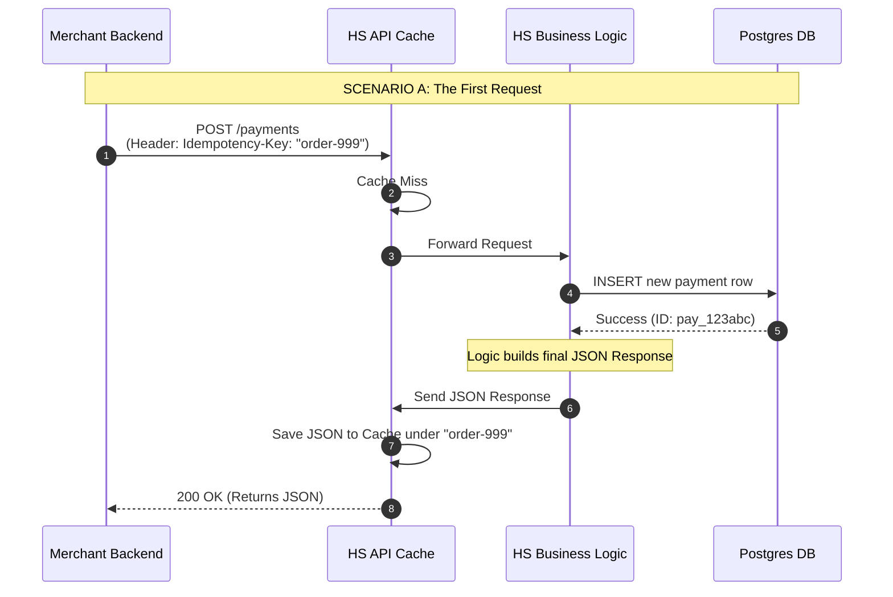
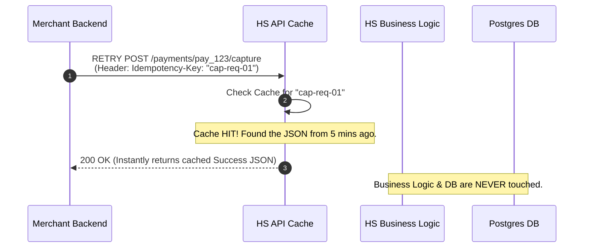
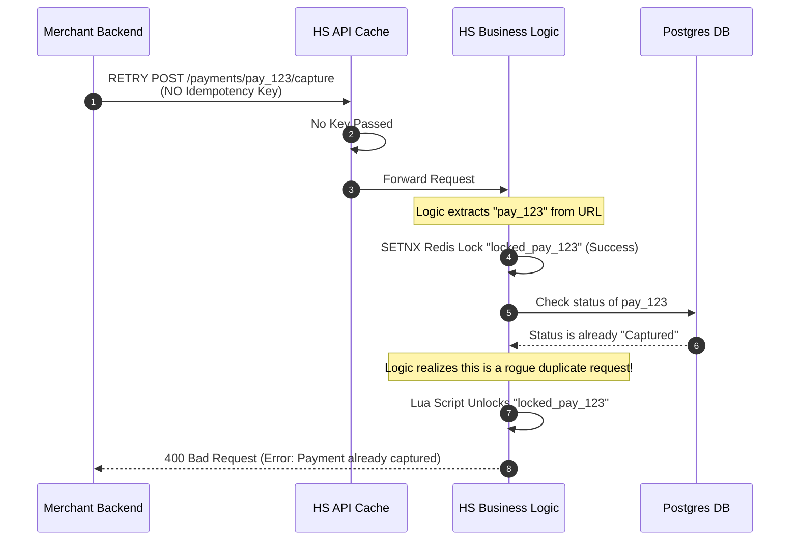

# Understanding Idempotency in Hyperswitch

Hyperswitch uses Redis for **two completely different purposes** to ensure payments are safe, fast, and never double-charged. It is critical to understand the difference between **API Caching** and **Internal Resource Locking**.

## 1. API Caching vs Internal Resource Locking

| Feature | The API Cache | Internal Resource Lock |
|---------|---------------|------------------------|
| **Key Used** | `Idempotency-Key` (Optional HTTP Header) | `locked_{payment_id}` (Generated internally) |
| **Lifespan** | Very Long (e.g., 24 hours) | Very Short (Seconds - only during active processing) |
| **Value in Redis**| The full JSON API response (e.g. `{"status": "succeeded"}`) | A unique UUID v4 generated for the specific thread |
| **Purpose** | To return exactly what was returned last time, skipping all logic. | To act as a "Do Not Disturb" sign preventing race conditions in the Database. |
| **Analogy** | The VIP Bouncer at the front door. | The Metal Detector inside the building. |

---

## 2. Why Redis instead of the Database for Locking?

It might seem simpler to just add a `is_locked` boolean column to the `payment_intent` table in Postgres. However, for a high-performance payment router, this introduces severe distributed systems problems:

### A. The Race Condition (Read-Modify-Write)
If two identical requests hit the database simultaneously, they might both read `is_locked = false` before either can update it to `true`. 
*Fix:* You have to write a highly atomic query (like `UPDATE payments SET is_locked = true WHERE id = 123 AND is_locked = false` or use `SELECT ... FOR UPDATE`). While this solves the race condition, it brings us to problem B.

### B. Performance Bottlenecks
Row-level locks in a database hit the disk and block other queries. Under high traffic (like Black Friday), database locking will severely spike latency and bottleneck the system. Redis `SETNX` operates entirely in RAM and executes in microseconds.

### C. The Crash Problem (Orphaned Locks)
This is the fatal flaw of database locking. If a server updates the database to `is_locked = true` and then the server crashes (loses power or gets OOM killed), that database row is permanently stuck. The payment is frozen forever.
*Redis Solution:* Redis locks are created with a **TTL (Time-To-Live)**. If the server crashes, Redis acts as a dead-man's switch and automatically deletes the lock 30 seconds later, safely allowing a retry. 

---

## 3. Safe Redis Locking: Values and Deletion (The Redlock Pattern)

Managing distributed locks safely requires more than just calling `SETNX` and `DEL`. You must account for micro-millisecond race conditions.

### A. The Lock Value MUST be a UUID
When creating a lock via `SETNX`, you must pass a unique value. Hyperswitch generates a random **UUID v4** (e.g. `550e8400-e29b-41d4-a716-446655440000`) for the exact thread running the code. 
*Why not use a Server ID?* Because a single server runs thousands of concurrent threads. If you just used "Server-A" as the value, Thread 1 might accidentally delete a lock owned by Thread 2.

### B. The Raw `DEL` Danger
You can never use a raw `DEL locked_pay_123` command to release a lock. Here is the nightmare race condition it causes:
1. Thread A acquires the lock with a 30s TTL.
2. Thread A experiences a network delay and takes 31 seconds. 
3. Redis automatically drops the lock at 30 seconds due to the TTL.
4. Thread B swoops in and acquires the lock with a new UUID.
5. Thread A wakes up, finishes its work, and blindly calls `DEL`. 
6. **Thread A just deleted Thread B's lock!** Now Thread C can enter, and the DB gets corrupted.

### C. The Lua Script Solution
To safely unlock, Thread A must check if the lock value still matches its original UUID before deleting it. However, a `GET` followed by a `DEL` in Rust creates a split-second gap where another thread could steal the lock.

**The Fix:** Hyperswitch sends a tiny Lua script to Redis:
```lua
if redis.call("get", KEYS[1]) == ARGV[1] then
    return redis.call("del", KEYS[1])
else
    return 0
end
```
Because Redis is single-threaded, it executes Lua scripts **atomically**. It performs the `GET`, checks the UUID, and runs the `DEL` in one unbroken motion, making it mathematically impossible for the TTL expiration or another thread to jump in the middle!

---

## 4. Sequence Diagram: Payment Creation
When you create a payment (`POST /payments`), Hyperswitch creates the payment in Postgres, generates a JSON response, and permanently caches that JSON response in Redis tied to your `Idempotency-Key`.



---

## 5. Sequence Diagram: The Duplicate Capture Call
If your network crashes and you retry a `Capture` request that was already successfully processed, the order of operations depends entirely on whether you remembered to pass the `Idempotency-Key`!

### Scenario A: Retrying WITH the Idempotency Key (The Happy Path)
Because you brought your VIP ticket (the Idempotency Key), the API Cache intercepts the request immediately. The Business Logic and Database are completely ignored.



### Scenario B: Retrying WITHOUT the Idempotency Key (The Error Path)
Because you forgot your VIP ticket, the API Cache lets you through to the Business Logic. The Business Logic has to use its **Internal Resource Lock** and check the database.


