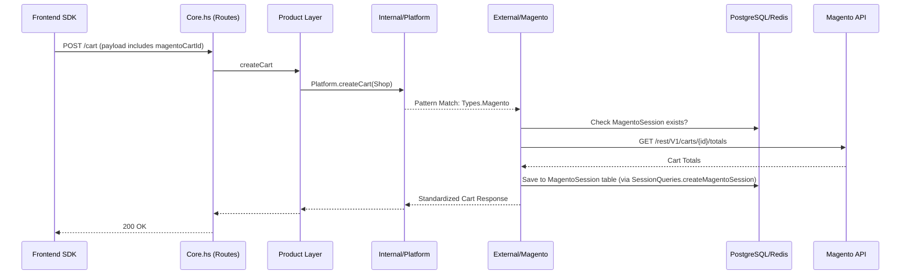
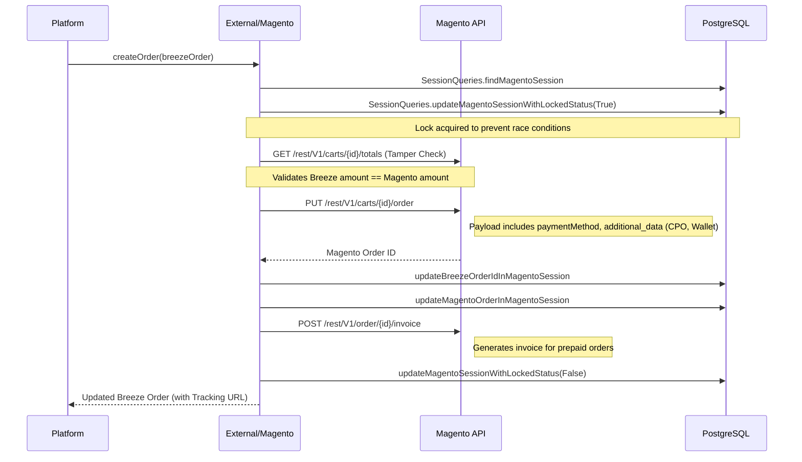
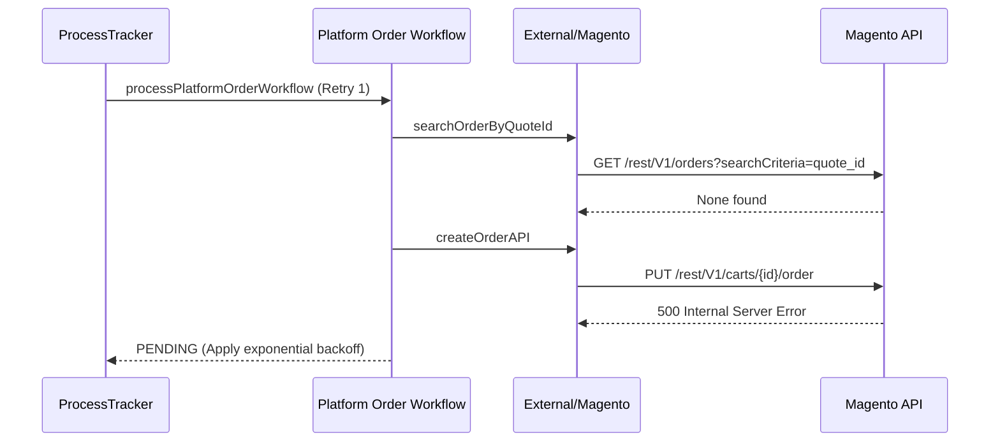
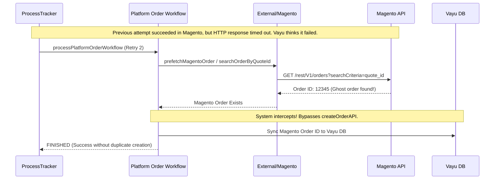

# Magento Integration Deep-Dive

This document is a comprehensive, code-backed analysis of the Magento integration within the Vayu backend. It is designed to prepare you for an Engineering Director-level technical discussion, focusing on architecture, request flows, reliability mechanisms, and specific challenges you solved.

---

## 1. Magento Architecture

### 1.1 Where Magento Fits

Vayu uses a **3-layer architecture** (Core → Product → Services). The Magento integration lives entirely in the **Services** layer, specifically:

1. **`Services/Internal/Platform/`**: The generic platform dispatch layer. It uses pattern matching on the `ShopType` enum (e.g., `Types.Shopify`, `Types.Magento`) to route requests.
2. **`Services/External/Magento/`**: The Magento-specific implementation (14 modules including `Cart.hs`, `Order.hs`, `Coupon.hs`, `Tracker.hs`).

**Architectural Rule**: The Product layer knows *nothing* about Magento. It asks the Internal Platform layer to "create an order," and the Platform layer dispatches that to the External Magento module.

### 1.2 End-to-End Request Flow

---

## 2. Complete Magento Request Flows

### 2.1 Cart Creation Flow (`Magento/Cart.hs`)

**Purpose**: Translates a Breeze cart creation request into a synchronized Magento session. Unlike other platforms, Vayu does not call a Magento API to create the cart; the cart is created by the frontend/Magento before Breeze loads.

1. **Extract Cart ID**: The frontend SDK passes the existing `magentoCartId` inside the `POST /cart` request body.
2. **Unmasking & Fetch Totals**: Vayu first checks if the provided ID is a masked GraphQL cart ID. If so, it calls `GET /rest/V1/guest-carts/{gqlcartid}` to unmask it and retrieve the actual numeric Magento Cart ID. Then it calls `GET /rest/V1/carts/{cartId}/totals` (via `getCartTotals`) to fetch the current state of the Magento cart.
3. **Sessionizer**: The actual numeric `magentoCartId` and the fetched cart totals are saved into the `magento_session` DB table via `SessionQueries.createMagentoSession`.
4. **Item Mapping**: The fetched Magento cart items are transformed into the standardized Breeze cart format.

### 2.2 Coupon Application (`Magento/Coupon.hs`)

**Purpose**: Applies a discount code to the Magento cart and recalculates totals.

1. **Lookup Session**: Fetches `magentoCartId` from `magento_session` using the `BreezeCartId`.
2. **Apply to Magento**: Calls `PUT /rest/V1/carts/{cartId}/coupons/{couponCode}`.
3. **Recalculate Totals**: Fetches updated cart totals from Magento.
4. **Tech Debt Note**: `Coupon.hs` (an External module) directly imports `Vayu.Services.Internal.Offer` and `Vayu.Storage.Queries.Cart` to update the Breeze database with the new discount amounts. This is an **architectural violation** (External modules should only make HTTP calls, not DB queries). *This was done for speed of delivery but should be refactored.*

### 2.3 Order Creation Flow (`Magento/Main.hs` & `Magento/Order.hs`)

**Purpose**: Converts the Magento cart into a placed order. This is the most complex flow.

### 2.4 Analytics Tracker Flow (`Magento/Tracker.hs`)

**Purpose**: Extracts Magento cart line items for Facebook CAPI and Google Analytics.
- Retrieves `MagentoSessionCart` from the DB.
- Decodes the JSON blob.
- Maps Magento line items to standardized `PurchaseEvent` format.

---

## 3. The `MagentoSession` Deep-Dive

### What it is
`MagentoSession` is a PostgreSQL table (`magento_session`) that maintains stateful mappings between Vayu and Magento. 

Like other platform integrations (such as Shopify with its `ShopifySession`), Magento requires tracking complex session state throughout the checkout. You must map the Vayu Cart ID to the Magento Cart ID, securely store the Customer Token (if authenticated), and eventually track the resulting Magento Order ID.

### Lifecycle
1. **Creation**: Created during cart init. Maps `breeze_cart_id` → `magento_cart_id`.
2. **Evolution**: If a guest logs in, the session is updated with their Magento customer token.
3. **Locking**: During order creation, `locked` is set to `True`.
4. **Completion**: Updated with `magento_order_id`, `breeze_order_id`, and invoice details when checkout completes.

### Why it exists
If `MagentoSession` were missing, **every Magento API call would fail** because Vayu wouldn't know which Magento cart to manipulate. It is the critical state bridge between the two systems.

---

## 4. Challenges Faced & Solved

### Challenge 1: Magento API Failures & Retries

**The Problem**: Magento APIs (especially order creation) occasionally threw 500 Internal Server Errors or timed out, causing checkout failures for customers.

**The Solution**: 
- A generic retry wrapper was implemented in `Utils/External.hs` (`callAPIWithRetries`).
- **How it works internally**: It is a recursive function that takes the API endpoint, the payload, a `conditionToRetry` function, and a `currentRetryCount` (which acts as the "retries remaining" counter). 
- **When it stops**: After every API call, it passes the HTTP response to a helper function called `canRetry`. 
  - If `currentRetryCount` is 0, it immediately stops and returns the final response.
  - If the response matches the retry condition (`Utils.findIfOrderInternalServerError` which checks for 5xx errors), `canRetry` decrements the counter (`currentRetryCount - 1`). The function then recursively calls itself with the new count.
  - If the response is a success (200 OK) or a non-retryable error (like a 400 Bad Request), `canRetry` returns 0, terminating the recursion instantly.
- The initial retry count is pulled dynamically from the shop configuration (`BreezeUtils.getRetriesForOrderCreationInMagento`).
- **Idempotency**: Retrying a Magento `PUT /order` on the same cart is generally safe because once the cart is converted to an order, subsequent calls fail cleanly or return the existing order, preventing duplicate charges.

### Challenge 2: Race Condition (Order Finish vs Webhook)

**The Problem**: Sometimes, two identical orders were created in Magento for a single Breeze checkout.

**The Cause**: When a payment succeeded, the frontend polled the `orderStatusSync` endpoint to complete the order. Simultaneously, the payment gateway fired a server-to-server webhook. Both flows eventually called `Platform.createOrder`. If they arrived at the exact same millisecond, they both fetched the Magento cart, and both told Magento to convert it to an order.

**The Solution**: Distributed Locking via the `MagentoSession` table.
- Before calling Magento's create order API, the code runs: `SessionQueries.updateMagentoSessionWithLockedStatus breezeCartId True`.
- If a second concurrent request arrives, it checks `isMagentoSessionLocked`. 
- If `True`, the request *aborts* order creation, assumes the other request/server is handling it, and attempts to fetch the existing order instead.
- Once finished, the lock is released (`False`).

### Challenge 3: Cart Tampering Prevention

**The Problem**: Malicious users could potentially alter the Breeze cart amount in the browser, paying less than the actual Magento cart value.

**The Solution**: In `Magento/Main.hs`, before creating the order, the code explicitly fetches the Magento cart totals directly from the Magento server (`Cart.getCartTotals`). It compares the `orderAmount` (what the user paid) with `magentoCartTotals.grand_total`. If they differ, it triggers `isCartTampered`, logs an error (`"ER-0C1" "Order amount mismatch"`), and throws a 400 Bad Request, blocking the order creation.

> [!IMPORTANT]
> ### Challenge 4: Magento Order Creation Failures (Payment Success vs Platform Failure)
> 
> **The Problem**: 
> A customer pays successfully via the Euler/JusPay gateway, but the synchronous call to Magento's `createOrderAPI` fails (due to a 500 error or network timeout). This creates a critical business inconsistency: **The customer was charged, but no Magento order exists.**
> 
> **How Vayu Detects It**:
> When payment succeeds, the order status transitions to `SUCCESS` (or `PARTIALLY_PAID`). This state transition automatically triggers the `OrderStatusCheckWorkflow`.
> 
> **The Recovery Mechanism (ProcessTracker)**:
> 1. The `OrderStatusCheckWorkflow` detects the success state and spawns a new ProcessTracker task: `RunnerEnum_PLATOFORM_ORDER_CREATION_WORKFLOW`. (This inserts a persistent record into the `process_tracker` PostgreSQL table).
> 2. The async PT worker (`processPlatformOrderWorkflow`) picks this up and attempts to create the Magento order asynchronously.
> 3. If the Magento API fails *again*, the workflow returns a `pendingWorkflowResponse`, causing ProcessTracker to retry it later using **exponential backoff** (e.g., 2min, 4min, 8min...).
> 
> **The "Ghost Order" Risk & Idempotency**:
> Retrying order creation is dangerous. What if Magento *did* create the order on the previous attempt, but the HTTP response dropped due to a timeout? If Vayu retries `createOrderAPI`, Magento might throw an error or create a duplicate order.
> 
> **The Solution (MissingOrderResolution)**:
> Before retrying, the worker runs `MissingOrderResolution.evaluateMissingOrderResolution`.
> - This calls `prefetchMagentoOrder` → `searchOrderByQuoteId` (in `Magento/Order.hs`).
> - Vayu asks Magento: "Do you already have an order for this Quote ID (Cart ID)?"
> - If Magento says YES: Vayu intercepts the workflow, updates the local DB with the Magento Order ID, and marks the task as finished! No duplicate order is created.
> - If Magento says NO: Vayu proceeds with retrying `createOrderAPI`.
> 
> **Ultimate Fallback (Repeated Failures)**:
> If Magento is down for hours and the task hits `MANDATE_PLATFORM_ORDER_MAX_RETRY_COUNT` (default: 5):
> - The Vayu order status is forcefully updated to `AUTO_CANCELLED`.
> - **Notification**: `MissingOrderResolution` calls `sendMerchantNotificationEmail`. It sends a high-priority email to the merchant ("Action Required: Missing Order on Your Platform - Order ID: XYZ") containing the customer's phone, email, and the paid order value.
> - **Customer Perspective**: They were charged, but the merchant is explicitly alerted to either fulfill the order manually or issue a refund via the dashboard.

#### Standard Retry Flow Diagram

#### The "Ghost Order" (Dropped Response) Resolution Flow

**Interview Explanation**:
> "One of our most critical reliability problems was when a customer's payment succeeded, but the Magento API failed during order creation. This left the customer charged with no merchant order. 
> 
> We solved this by hooking into our `ProcessTracker` distributed scheduler. When a payment succeeds, we spawn a `PLATFORM_ORDER_CREATION` async task. If the synchronous API call fails, this async worker retries using exponential backoff.
> 
> The hardest part was preventing 'ghost orders'—what if Magento created the order but the network dropped the response? If we blindly retried, we'd cause duplicate orders. I utilized a `MissingOrderResolution` flow: before every retry, we explicitly query Magento by the Cart Quote ID. If the order already exists, we simply sync the ID locally and abort the creation attempt, acting as a powerful idempotency key.
> 
> Finally, if Magento is hard-down and we exhaust all retries, the system marks our internal order as `AUTO_CANCELLED` and fires an automated alert email to the merchant with the customer's contact details so they can manually refund or fulfill it."

---

## 5. Interview Preparation (Director Level)

### Q1: "Walk me through the Magento integration you built."
**What they are testing**: Ability to explain a complex system concisely, highlighting architectural boundaries.
**Answer**: "Vayu uses a 3-layer architecture. I built the Magento integration entirely within the External Services layer, behind a generic Platform interface. It consisted of 14 modules handling carts, coupons, shipping, and orders. The most complex part was managing state—just like we do for Shopify with `ShopifySession`, Magento requires a persistent session bridge. I designed a `MagentoSession` PostgreSQL table to map Breeze carts to Magento carts and tokens, ensuring we could securely orchestrate the entire checkout lifecycle."

### Q2: "How did you prevent duplicate orders from being created in Magento?"
**What they are testing**: Understanding of concurrency, race conditions, and distributed locking.
**Answer**: "We encountered a severe race condition where the payment webhook (server-to-server) and the frontend polling (client-to-server) reached our backend simultaneously. Because Vayu spawns a lightweight thread for every HTTP request—and because we run multiple backend servers behind a load balancer—these two requests were executing concurrently and causing duplicate Magento orders. To fix this, I implemented a distributed lock on the `MagentoSession` PostgreSQL table. The first request to arrive sets `locked=True`. The second request sees the lock, aborts the creation process, and falls back to fetching the order the first request is creating. This completely eliminated duplicate orders."
**Trap to avoid**: Don't say you used Redis locks for this specific flow. The codebase explicitly uses PostgreSQL (`updateMagentoSessionWithLockedStatus`). 

### Q3: "What happens if a Magento API fails during order creation?"
**What they are testing**: Distributed transaction recovery, async reconciliation, and idempotency.
**Answer**: "If the synchronous API call fails after a successful payment, our `OrderStatusCheckWorkflow` detects the success state and spawns a `PLATFORM_ORDER_CREATION` ProcessTracker task. This worker retries order creation with exponential backoff. To ensure idempotency and prevent duplicate orders (in case of a dropped network response), the worker first queries Magento by the Cart Quote ID. If it finds the order, it syncs the state and stops. If it exhausts all retries, it marks the order as auto-cancelled and automatically emails the merchant to handle the edge case manually."

### Q4: "Why did you choose to email the merchant instead of automatically issuing a refund when max retries are reached?"
**What they are testing**: Product mindset, business logic tradeoffs, and handling edge cases in e-commerce.
**Answer**: "Automatic refunds sound great in theory, but in e-commerce, the merchant often prefers to keep the revenue and fulfill the order manually. Since the payment was already captured successfully by the gateway, automatically issuing a refund reverses a successful transaction for a purely technical failure on Magento's end. By alerting the merchant with the customer's details and the captured amount, we empower them to make the business decision—they can either manually create the order in Magento or issue the refund themselves."

### Q5: "How did you handle consistency between our database and Magento?"
**What they are testing**: Distributed transactions and state management.
**Answer**: "We couldn't use strict distributed transactions across HTTP boundaries. Instead, we used a 'verify-before-commit' approach. For example, before placing the order, we fetched the cart totals directly from Magento to ensure the amount the user paid exactly matched Magento's expected total. If it didn't, we threw a tampering error. If an order succeeded in Magento but our database update failed, our async `ProcessTracker` reconciliation loop would eventually sync the states."

### Q6: "If you were to rebuild this integration today, what would you change?"
**What they are testing**: Self-awareness, recognizing tech debt, and architectural maturity.
**Answer**: "I would refactor the coupon and discount application flow. Currently, the External Magento module makes direct database queries to update the Breeze cart with new discount amounts. This violates Clean Architecture principles. External modules should act purely as an anti-corruption layer for external APIs; they shouldn't know about our internal database schema. Furthermore, calling DB or Product logic from the External layer often leads to circular dependencies in Haskell (Product -> Internal -> External -> Product), forcing developers to bypass business logic and write raw queries. I would refactor it so the External module purely returns the discount data to the Internal layer, and the Internal layer handles the database writes. This guarantees separation of concerns and makes the system much easier to unit test."

---

## 6. Final Mental Model

**Memorize this paragraph:**
> "The Magento integration sits in the External Services layer, completely abstracted from the core Product logic. Because Magento requires stateful interactions, every checkout is anchored by a `MagentoSession` row in PostgreSQL, mapping the Breeze cart to the Magento cart. When a user checks out, we translate their actions into Magento REST API calls. To ensure reliability, we use configurable retries for flaky APIs, a database lock on the session table to prevent race conditions from concurrent webhooks, strict pre-order tamper checks, and a ProcessTracker-backed asynchronous reconciliation loop that uses the Cart Quote ID as an idempotency key to recover from dropped network responses."
