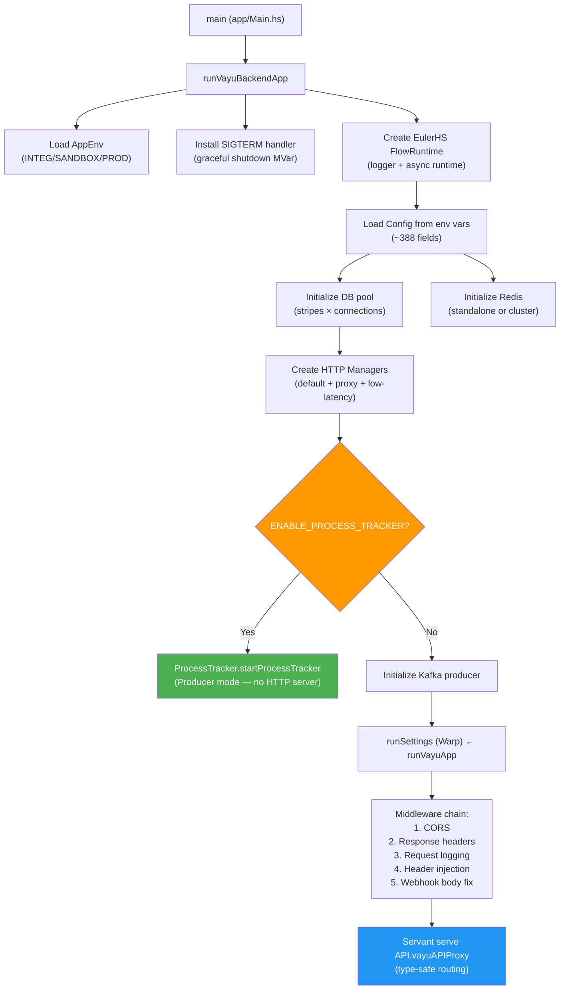
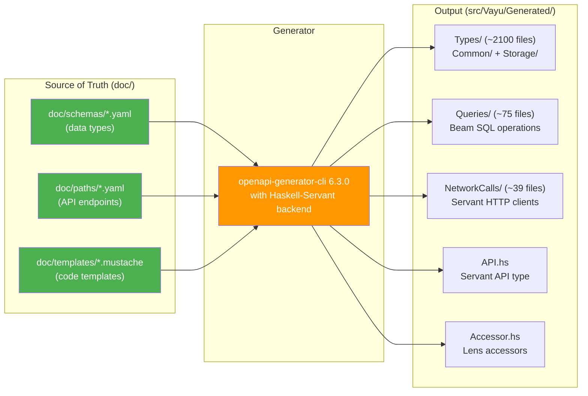

# Part 1 — Architecture & System Design

> Covers **Phase 1** (Understand the System), **Phase 3** (Architecture Deep-Dive), and **Phase 4** (Design Patterns)

---

## 1. What is Vayu?

**Vayu** is the Haskell backend powering **Breeze** — a one-click checkout SDK that embeds into e-commerce merchant websites. When a customer clicks "Buy Now," Breeze takes over the entire checkout: login, address, offers, payment, and order creation — all in a single overlay.

### The Business Problem

E-commerce checkout has 70%+ cart abandonment. Breeze solves this by:
1. Pre-filling customer data (address, phone) via OTP login
2. Showing offers (platform + payment gateway cashback) in one view
3. One-click payment with multiple gateways
4. Creating orders on the merchant's platform after payment

### Scale Indicators (from codebase evidence)

| Metric | Evidence | Source |
|--------|----------|--------|
| **API Surface** | 73 paths, 200+ endpoints | `doc/paths/` (YAML specs) |
| **DB Tables** | 75+ | `dbInitiateSql/` |
| **Platforms** | 7 (Shopify, WooCommerce, Magento, VTEX, CS-Cart, PrestaShop, Independent) | `ShopType` enum |
| **External Integrations** | 71+ service modules | `src/Vayu/Services/External/` |
| **Generated Code** | ~2100 type files, 75 query files, 39 network call files | `src/Vayu/Generated/` |

---

## 2. Tech Stack

| Layer | Technology | Why (from [TechDecisions.md](file:///Users/pratik.giramkar/Breeze/vayu/doc/TechDecisions.md)) |
|-------|-----------|------|
| **Language** | Haskell (GHC 8.10.7) | Type safety, in-house Euler team expertise, code reuse |
| **Web Framework** | Servant | Type-safe API routes, auto-generated client code |
| **ORM** | Beam | Type-safe SQL queries with Haskell type checking |
| **Database** | PostgreSQL | ACID transactions for financial data |
| **Cache** | Redis (standalone or cluster) | Session state, distributed locks, config cache, queues |
| **Build** | Stack + Cabal | Haskell dependency management |
| **Code Gen** | openapi-generator-cli 6.3.0 | Types, queries, network calls from YAML specs |
| **CI/CD** | Jenkins | Multi-stage pipeline (build → test → deploy) |
| **Kafka** | hw-kafka-client | Async event logging |
| **Observability** | Custom structured logging + Prometheus | GHC metrics, request tracing |
| **Feature Flags** | OpenFeature (Superposition) | Runtime feature toggling |

### Euler Framework (Critical Context)

Vayu doesn't use raw Haskell. It's built on **EulerHS** — JusPay's in-house framework providing:
- `FlowMonad.Flow` — the application monad (ReaderT Env over IO)
- `EulerRuntime` — manages DB pools, Redis connections, HTTP clients, pub-sub
- `runDB` — type-safe DB operations via Beam
- `callAPI` / `callAPIProxyEither` — typed HTTP client calls via Servant
- Structured logging with masking

> [!NOTE]
> **For interviews**: Vayu is NOT a greenfield Haskell project. It uses JusPay's production-grade `EulerHS` runtime, which handles connection pooling, DB migrations, and HTTP client management. You don't need to explain raw Haskell — frame it as "we use a typed framework that gives us type-safe SQL, type-safe API routes, and structured logging out of the box."

---

## 3. Application Bootstrap

**Entry point**: [App.hs](file:///Users/pratik.giramkar/Breeze/vayu/src/Vayu/App.hs)



### Key Design Decisions in Bootstrap

1. **Dual-mode deployment**: Same binary serves as either HTTP server OR ProcessTracker producer — controlled by `ENABLE_PROCESS_TRACKER` env var
2. **Three HTTP managers**: `default` (55s timeout), `mProxy` (via outbound proxy), `mLowLatencyManager` (configurable, default 3s)
3. **Local in-memory cache**: `LocalCache` for Shop, Merchant, and HighRiskPincodes — invalidated via Redis Pub/Sub
4. **Config is immutable**: All ~388 config fields loaded once at startup into the `Env` record, threaded through every request via `ReaderT`

---

## 4. The Three-Layer Architecture

> **Source**: [CLAUDE.md](file:///Users/pratik.giramkar/Breeze/vayu/CLAUDE.md), [01-architecture.md](file:///Users/pratik.giramkar/Breeze/vayu/plan/01-architecture.md)

```
┌─────────────────────────────────────────────────────────────┐
│  Routes/Core.hs (6647 lines)                                │
│  Servant route handlers → auth → dispatch to Product layer   │
└─────────────────────┬───────────────────────────────────────┘
                      │ calls
┌─────────────────────▼───────────────────────────────────────┐
│  Product/ (57 modules)                                       │
│  "Business Orchestration Layer"                              │
│  • Logging wrappers (withProductAPILogging)                  │
│  • Auth validation                                           │
│  • Coordinates multiple Service calls                        │
│  • Feature flag checks                                       │
│  • Async spawning (spawnThread)                              │
│  • NEVER does DB queries directly (with documented           │
│    violations)                                                │
└─────────────┬──────────────────────┬────────────────────────┘
              │ calls               │ calls
┌─────────────▼──────────┐ ┌───────▼──────────────────────────┐
│  Services/Internal/     │ │  Services/External/               │
│  (Domain Logic)         │ │  (3rd-Party API Calls)            │
│  • Business rules       │ │  • Shopify, WooCommerce, Magento │
│  • DB queries (Beam)    │ │  • JusPay/Euler (payments)        │
│  • Redis operations     │ │  • Gupshup, Kaleyra (SMS)        │
│  • Data transformations │ │  • ClickPost, BlueDart (shipping)│
│  • Platform dispatch    │ │  • Facebook, GA4 (analytics)      │
│                         │ │  • Supermoney (wallet)            │
│  Calls External/ for    │ │                                   │
│  3rd-party integration  │ │  Rules: NO DB, NO business logic  │
└─────────────────────────┘ │  (with documented violations)     │
                            └───────────────────────────────────┘
```

### Layer Rules (Confirmed from CLAUDE.md)

| Rule | Product Layer | Services/Internal | Services/External |
|------|:---:|:---:|:---:|
| Business orchestration | ✅ | ❌ | ❌ |
| DB queries | ❌ | ✅ | ❌ (violated by Shopify, Magento, Euler) |
| Redis access | ✅ (explicitly allowed) | ✅ | ❌ (violated by Euler) |
| External API calls | ❌ | ❌ | ✅ |
| Feature flag checks | ✅ | ❌ | ❌ |
| Async spawning | ✅ | ❌ | ❌ |
| Structured logging | `withProductAPILogging` | `logFunctionCalled/CallResult` | `logFunctionCalled/CallResult` |

### Known Architecture Violations (Tech Debt)

| File | Violation | Severity |
|------|-----------|----------|
| [Shopify/Offers.hs](file:///Users/pratik.giramkar/Breeze/vayu/src/Vayu/Services/External/Shopify/Offers.hs) | Imports DB queries, contains business logic | CRITICAL |
| [Magento/Main.hs](file:///Users/pratik.giramkar/Breeze/vayu/src/Vayu/Services/External/Magento/Main.hs) | Imports `Storage.Queries.MagentoSession`, contains discount calc | CRITICAL |
| [Magento/Coupon.hs](file:///Users/pratik.giramkar/Breeze/vayu/src/Vayu/Services/External/Magento/Coupon.hs) | Contains `modifyOffersAndCart` with cart mutations | CRITICAL |
| [Euler/Offer/Main.hs](file:///Users/pratik.giramkar/Breeze/vayu/src/Vayu/Services/External/Euler/Offer/Main.hs) | Redis caching + offer-based locking logic | HIGH |
| Product/OfferCode/Main.hs | Directly imports Generated.Queries | MEDIUM |

> [!TIP]
> **For interviews**: "We had documented architecture violations in legacy code — External services doing DB queries. We didn't refactor them all at once, but new code strictly follows the layered rules. This is a pragmatic tradeoff between refactoring cost and feature velocity."

---

## 5. Code Generation Pipeline

> **Source**: [CLAUDE.md](file:///Users/pratik.giramkar/Breeze/vayu/CLAUDE.md) "Golden Rules"

This is one of the most distinctive architectural decisions: **60% of the code is auto-generated**.

### The Pipeline



### Three Generation Commands

| Command | Input | Output | Files |
|---------|-------|--------|-------|
| `pnpm run generate:types` | `doc/schemas/` + `doc/templates/` | `Generated/Types/` + `Generated/Accessor.hs` | ~2100 |
| `pnpm run generate:queries` | `doc/schemas/` + `doc/templates/` | `Generated/Queries/` | ~75 |
| `pnpm run generate:network-calls` | `doc/paths/` + `doc/templates/` | `Generated/NetworkCalls/` + `Generated/API.hs` | ~39 |

### Golden Rules

1. **NEVER** manually edit files in `src/Vayu/Generated/`
2. All type changes → edit `doc/schemas/*.yaml` → regenerate
3. All API route changes → edit `doc/paths/*.yaml` → regenerate
4. Template logic changes → edit `doc/templates/*.mustache` → regenerate
5. The YAML specs are the **single source of truth** — any other edits will be overwritten

> [!IMPORTANT]
> **Interview Gold**: "Our code generation pipeline ensures type-safety at the API boundary AND the database layer. When you change a schema in YAML, the compiler catches every function that needs updating — there's no runtime deserialization surprise. This is fundamentally different from dynamically typed API frameworks."

---

## 6. Platform Abstraction (ShopType Dispatch)

> **Source**: [11-platform-layer.md](file:///Users/pratik.giramkar/Breeze/vayu/plan/11-platform-layer.md)

Breeze supports 7 e-commerce platforms. The platform abstraction lives in `Services/Internal/Platform/`:

```
Services/Internal/Platform/
  ├── Cart.hs         — createCart, updateCart by ShopType
  ├── Order.hs        — createOrder, getOrder by ShopType
  ├── Offer.hs        — applyOffer, removeOffer by ShopType
  ├── Tracker.hs      — analytics by ShopType
  ├── Shipping.hs     — shipping by ShopType
  ├── Zone.hs         — shipping zones by ShopType
  ├── Webhook.hs      — webhook handlers by ShopType
  └── Address.hs      — address formats by ShopType
```

### Dispatch Pattern

```haskell
-- Services/Internal/Platform/Order.hs (conceptual)
createPlatformOrder shop order = case shop ^. shopType of
  ShopType_SHOPIFY      → Shopify.createOrder shop order
  ShopType_WOOCOMMERCE  → WooCommerce.createOrder shop order
  ShopType_MAGENTO      → Magento.createOrder shop order
  ShopType_CSCART       → CsCart.createOrder shop order
  ShopType_VTEX         → VTEX.createOrder shop order
  ShopType_PRESTA       → Presta.createOrder shop order
  ShopType_INDEPENDENT  → Independent.createOrder shop order
```

### Two Dispatch Flavors

1. **Simple ShopType switch**: `case shop ^. shopType of` — used when behavior varies only by platform
2. **Compound `(OrderStatus × ShopType)` switch**: Used in `Platform/Order.hs` where behavior varies by BOTH order status AND platform

> [!NOTE]
> **For interviews**: "Instead of using a class hierarchy or strategy pattern (which would be the OOP approach), we use simple ADT pattern matching. In Haskell, the compiler guarantees exhaustiveness — if you add a new ShopType constructor, every case expression that doesn't handle it becomes a compile error. This is actually stronger than virtual dispatch because it's checked at compile time."

---

## 7. Design Patterns (with Code Evidence)

### Pattern 1: Product Layer Orchestration

**Where**: Every `Product/` module  
**What**: Product functions coordinate multiple Service calls, manage side effects, and handle cross-cutting concerns.

```haskell
-- Product/Cart/Main.hs (conceptual)
createCart reqBody = withProductAPILogging tag POST "/cart" reqBody $ do
  shop     ← fetchShop shopUrl
  cart     ← Internal.Cart.createCartWithItems shop reqBody    -- Domain logic
  _        ← Platform.Cart.createCart shop cart                 -- Platform sync
  payment  ← Internal.Payment.createSession shop cart           -- Payment session
  _        ← spawnThread $ CustomerIngestion.ingest customer    -- Async side effect
  _        ← spawnThread $ Campaign.triggerEvent cart           -- Async side effect
  pure $ CartCreateResponse cart payment
```

### Pattern 2: Either-Based Error Handling

**Where**: Throughout the codebase  
**What**: All fallible operations return `Either Error a`. Product layer decides what to do with errors.

```haskell
-- External services return Either
bulkDebit :: Request → Flow (Either Text Response)

-- Product layer handles errors
result ← SupermoneyService.bulkDebit request
case result of
  Left err  → Logger.logAndThrowErr500 tag err
  Right resp → processResponse resp
```

**Variant — `>>=>>`** (Short-circuit combinator from `Utils.Either`):
```haskell
-- Pipeline-style error handling in Identity flows
runRegularPipeline =
  (buildContext >>= validateContext)
    >>=>  checkRateLimits
    >>=>  generateOtpSession
    >>=>  buildSmsTemplate
    >>=>  dispatchOtp
    >>= handlePipelineResult
```

### Pattern 3: Master-Worker via ProcessTracker

**Where**: [ProcessTracker](file:///Users/pratik.giramkar/Breeze/vayu/plan/14-process-tracker.md), [Supermoney](file:///Users/pratik.giramkar/Breeze/vayu/src/Vayu/Product/Supermoney/MasterWorkflow.hs)  
**What**: Master creates tasks, batches them via Redis queue, spawns N worker ProcessTracker tasks.

```
Master PT Task:
  1. Query DB for pending work items
  2. Batch into groups of N
  3. Push batches to Redis queue
  4. Create M worker PT tasks
  5. Schedule next day's master task (cascading)

Worker PT Task:
  1. Pop batch from Redis queue
  2. Process batch (API call, DB updates)
  3. Handle failures (retry or alert)
  4. Repeat until queue empty → FINISHED
```

### Pattern 4: Cascading Tasks

**Where**: ProcessTracker `WorkFlowResponse`  
**What**: A workflow can spawn a follow-up task as part of its response.

```haskell
data WorkFlowResponse = WorkFlowResponse
  { _ptState       :: PTStatuses           -- FINISHED, PENDING, CANCELLED
  , _timeOffset    :: Int                  -- Seconds before next retry
  , _cascadingTask :: Maybe ProcessTracker -- Optional follow-up task
  }
```

Example chain: `OrderStatusCheck → PlatformOrderCreation → AbandonmentCheckout`

### Pattern 5: Three-Tier Configuration with Fallback

**Where**: [18-config-system.md](file:///Users/pratik.giramkar/Breeze/vayu/plan/18-config-system.md)  
**What**: `Shop Config (DB) → Global Config (Redis) → Env Config (startup)`. Non-null at any tier wins.

```
getFeatureValue shopConfig globalConfig envConfig =
  shopConfig.value        -- Tier 3: per-shop override
    <|> globalConfig.value -- Tier 2: global dynamic config
    <|> envConfig.value    -- Tier 1: env var default
```

### Pattern 6: Distributed Locking (Three Levels)

**Where**: ProcessTracker, Payment, Offer  
**What**: Redis-based SET-IF-NOT-EXISTS locks at three granularities:

| Level | Redis Key Pattern | TTL | Purpose |
|-------|-------------------|-----|---------|
| **Producer** | `PRODUCER_LOCK` | 1000s | Single-producer guarantee |
| **Task** | `pt:consumer:{taskId}` | 150s | No parallel task execution |
| **Workflow State** | `state:cart:{cartId}` | 200s | No concurrent entity mutation |

### Pattern 7: Feature Flag Gating (Dual Implementation)

**Where**: Identity flows (Login, VerifyOTP, StartPayment), Offer flows  
**What**: New implementations coexist with legacy via feature flags.

```haskell
handleUserLogin reqBody = do
  useV2 ← getShopConfig shop >>= (^. useLoginV2Flow)
  if useV2
    then runLoginPipeline reqBody       -- New pipeline architecture
    else Legacy.userLogin reqBody        -- Old monolithic flow
```

### Pattern 8: Idempotent Task IDs

**Where**: [ProcessTracker/Constants.hs](file:///Users/pratik.giramkar/Breeze/vayu/src/Vayu/Product/ProcessTracker/Constants.hs)  
**What**: Deterministic task IDs based on business keys prevent duplicate tasks.

```
Order Status Check:  "ord_sts_wfl_{cartId}"
Abandon Checkout:    "abd_chk_wfl_{eventName}_{cartId}"
Rollup Backfill:     "rollup_backfill_master"  (singleton)
```

DB unique constraint → inserting duplicate = "already scheduled" (not an error).

### Pattern 9: Bracket Pattern for Resource Safety

**Where**: Consumer task execution, Kafka lifecycle, Supermoney batch processing  
**What**: Haskell's `bracket` ensures cleanup even on exceptions.

```haskell
-- ProcessTracker Consumer
executePTTaskWithLock task =
  bracket
    (setConsumerLock taskId)      -- Setup: acquire Redis lock
    (\_ → removeConsumerLock taskId) -- Cleanup: release lock (always runs)
    (\isLocked → executePTTask task isLocked) -- Action
```

### Pattern 10: Crash Recovery via Processing Keys

**Where**: [Supermoney WorkerWorkflow](file:///Users/pratik.giramkar/Breeze/vayu/src/Vayu/Product/Supermoney/WorkerWorkflow.hs)  
**What**: Before processing a batch, store it in a `processing:{queueName}:{batchId}` Redis key. On crash, master recovers these keys and re-queues.

```haskell
processBatches queueName = do
  batch ← popFromQueue queueName
  setExRedis processingKey batch 3600    -- Track in-flight batch
  addBatchToTracking trackingKey batchId
  processBatch batch                     -- Do the work
  deleteKeyRedis processingKey           -- Cleanup on success
  removeBatchFromTracking trackingKey batchId
  processBatches queueName               -- Loop
```

---

## 8. Module Map (Key Domains)

| Domain | Product Module | Internal Service | External Service | DB Tables |
|--------|---------------|-----------------|-----------------|-----------|
| **Cart** | `Product/Cart/Main.hs` | `Internal/Cart/` | Platform-specific | `cart`, `cart_item` |
| **Order** | `Product/Order/` | `Internal/Order/` | Platform-specific | `order`, `transaction` |
| **Payment** | `Product/Payment/` | `Internal/Payment/` | `Euler/` | `transaction`, `payment_method` |
| **Offer** | `Product/Offer.hs` | `Internal/Offer/` | Platform + Euler | `offer`, `offer_code` |
| **Identity** | `Product/Identity/` | `Internal/Customer/` | SMS/WhatsApp providers | `customer`, `otp_session` |
| **Shipping** | `Product/Shipping/` | `Internal/Shipping/` | ClickPost, BlueDart | `shipping_zone/provider/rule` |
| **Abandonment** | `Product/Abandonment/` | `Internal/Abandonment/` | Notification providers | — (uses `cart`, `order`) |
| **ProcessTracker** | `Product/ProcessTracker/` | `Internal/ProcessTracker/` | `External/Consumer/` | `processTracker` |
| **CPO** | `Product/Payment/CPO.hs` | `Internal/Payment/CPO/` | 18 providers | `custom_payment_option`, `applied_cpo` |
| **Supermoney** | `Product/Supermoney/` | `Internal/Transaction/` | `External/Supermoney/` | `transaction` |
| **Analytics** | `Product/ExternalTracker.hs` | `Internal/Tracker/` | FB CAPI, GA4, WebEngage | `cart_meta_data` |
| **Notification** | `Product/MessageService.hs` | `Internal/MessageService.hs` | Gupshup, Kaleyra, Fyno, etc. | `notification_log`, `message_credentials` |

---

## 9. Architecture Decision Records (Key Tradeoffs)

### Why Haskell?
- **Confirmed**: JusPay had existing Haskell infrastructure (EulerHS framework). In-house expertise. Type safety critical for financial operations.
- **Tradeoff**: Slower compile times, smaller hiring pool. Mitigated by code generation (60% of code is auto-generated, no Haskell knowledge needed to change types).

### Why Code Generation Over Manual Types?
- **Confirmed**: With 75+ tables and 200+ API endpoints, manually maintaining Haskell types, Beam schemas, and Servant APIs would be prohibitively error-prone.
- **Tradeoff**: Template complexity, indirection in debugging generated code. Mitigated by "never edit generated files" rule.

### Why PostgreSQL + Redis (Not a Distributed DB)?
- **Confirmed**: ACID needed for payment/order data. Redis for hot-path caching and distributed coordination.
- **Tradeoff**: Single PostgreSQL instance is a scaling bottleneck. **Unknown**: Whether read replicas are used (not visible in codebase).

### Why ProcessTracker Over a Message Queue (Kafka/RabbitMQ)?
- **Confirmed**: ProcessTracker uses PostgreSQL as the task store — no additional infrastructure. Built-in retry, backoff, cascading, idempotency.
- **Tradeoff**: Producer polls DB every 10s (not truly event-driven). Implicit cleaner means no row deletion (table grows unboundedly).

### Why Monolith Over Microservices?
- **Confirmed**: Single binary deployed in two modes (API + ProcessTracker). All domains share the same DB, Redis, and config.
- **Tradeoff**: Blast radius is the entire system. Mitigated by feature flags and platform dispatch patterns that provide logical separation.

---

## 10. Key Terminology for Interviews

| Term | Meaning in Vayu |
|------|-----------------|
| **Shop** | A merchant's e-commerce store (one Shop = one Breeze integration) |
| **Cart** | A checkout session — created when customer clicks "Buy Now" |
| **Platform** | The e-commerce engine (Shopify, WooCommerce, Magento, etc.) |
| **Platform Order** | The order created on the merchant's platform after payment |
| **Breeze Order** | The internal order record in Vayu's DB |
| **CPO** | Custom Payment Option — loyalty/wallet/gift card credits |
| **ProcessTracker (PT)** | Vayu's distributed task scheduler (DB-backed, Redis-locked) |
| **Runner** | A PT workflow type (e.g., ORDER_STATUS_CHECK_WORKFLOW) |
| **Flow** | The application monad (`ReaderT Env IO`) — all business logic runs in `Flow` |
| **EulerHS** | JusPay's Haskell framework providing DB, Redis, HTTP, and logging primitives |
