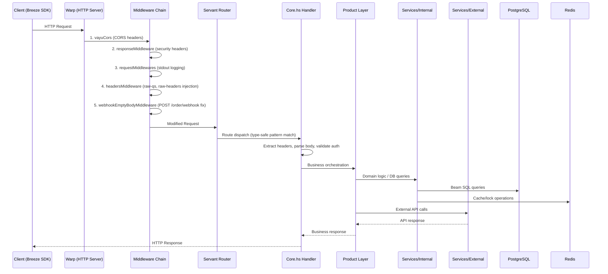
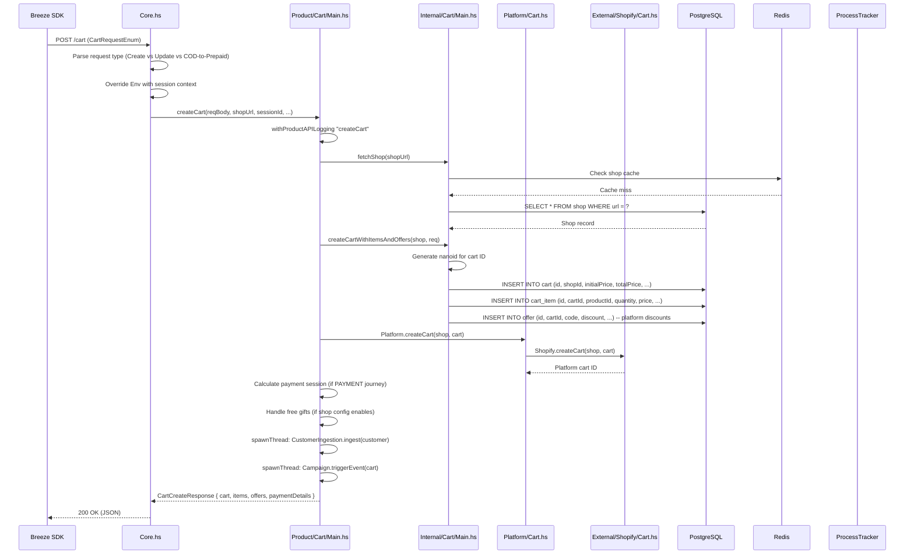
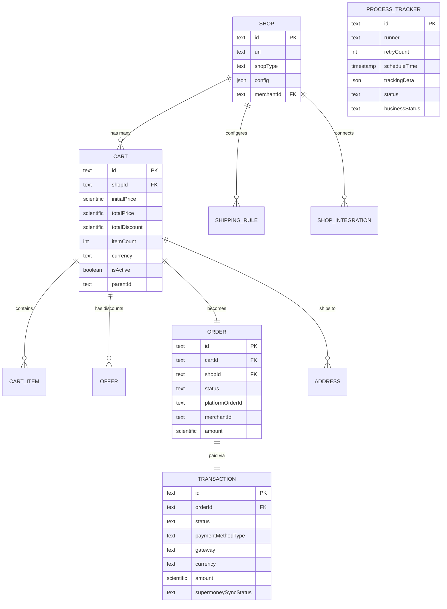

# Part 2 — Request Lifecycle & Data Layer

> Covers **Phase 2** (Trace the Request Lifecycle) and **Phase 5** (Data Layer Deep-Dive)

---

## 1. HTTP Request Processing Pipeline

Every request follows this exact path through the codebase:



### Middleware Chain (Confirmed from [App.hs:219-224](file:///Users/pratik.giramkar/Breeze/vayu/src/Vayu/App.hs#L217-L224))

```haskell
commonMiddleware =
  Cors.vayuCors                        -- 1. CORS (allowed origins from config)
  . Response.responseMiddleware        -- 2. Security headers (X-Frame-Options, CSP, etc.)
  . Request.requestMiddlewares         -- 3. logStdoutDev (request logging)
  . Request.headersMiddleware          -- 4. Inject raw-qs + raw-headers
  . Request.webhookEmptyBodyMiddleware -- 5. Replace empty POST /order/webhook body with "{}"
```

### Servant Routing

The route type is auto-generated in `Generated/API.hs` from `doc/paths/*.yaml`. Each endpoint maps to a handler in [Core.hs](file:///Users/pratik.giramkar/Breeze/vayu/src/Vayu/Routes/Core.hs):

```haskell
-- App.hs:218
baseApp = serve API.vayuAPIProxy (runVayu env)

-- App.hs:227 — hoists from (ReaderT Env (ExceptT ServerError IO)) to Servant's Handler
runVayu env = hoistServer API.vayuAPIProxy (f env) API.runVayu'
```

### Context Threading

Every request carries the `Env` context:

```haskell
-- Types/App.hs
data Env = Env
  { runTime           :: FlowRuntime Text     -- DB pools, HTTP managers, Redis
  , config            :: Config               -- ~388 env var fields (immutable)
  , sessionId         :: Text                 -- From X-Session-Id header
  , requestId         :: Text                 -- From x-request-id header
  , shopUrl           :: Text                 -- From X-Shop-URL header
  , deviceId          :: Text                 -- From X-Device-Id header
  , localCache        :: LocalCache           -- In-memory cache (Shop, Merchant)
  , testingMode       :: Bool                 -- From X-Testing-Mode header
  , kafkaRuntime      :: Maybe KafkaRuntime   -- Async event logging
  , shutdownSignal    :: MVar ()              -- Graceful shutdown coordination
  , openFeatureClient :: Maybe Client         -- Feature flags (Superposition)
  }
```

---

## 2. Traced Request: Create Cart (the most common entry point)

> Every Breeze checkout begins with cart creation. This is the most critical flow.

### Request

```
POST /cart
Headers:
  X-Session-Id: "abc-123"
  X-Shop-URL: "merchant.myshopify.com"
  Authorization: Bearer <jwt>  (optional for cart creation)
Body: CartRequestEnum (CreateCartRequest variant)
```

### Full Trace



### Key Observations

1. **No transaction wrapping** — Cart, CartItem, and Offer INSERTs are individual DB calls (not wrapped in a single transaction). **Inferred**: This is because the Euler framework's `runDB` operates per-query.
2. **Async side effects** — Customer ingestion and campaign triggers are fire-and-forget (`spawnThread`). Failure doesn't affect the main response.
3. **Platform sync is synchronous** — The Shopify/WooCommerce cart creation call happens inline, blocking the response.

---

## 3. Traced Request: Payment Flow (the most complex flow)

> Source: [12-payment-flows.md](file:///Users/pratik.giramkar/Breeze/vayu/plan/12-payment-flows.md), [21-identity-flows.md](file:///Users/pratik.giramkar/Breeze/vayu/plan/21-identity-flows.md)

### Start Payment (POST /start-payment)

```
POST /start-payment
Headers: Authorization: Bearer <jwt>, X-Session-Id, X-Shop-URL
Body: { cartId, addressId, ... }
```

**23-phase execution** inside Product layer:

```
Product/StartPayment.hs → startPayment(req)
  │
  ├── CONTEXT PHASE:
  │   1. Validate JWT, fetch customer
  │   2. Fetch cart + items + offers + shipping
  │   3. Fetch shop + shopConfig
  │   4. Validate subscription (if applicable)
  │   5. Check COD eligibility
  │
  ├── PAYMENT PHASE:
  │   6. Create/update Order record in DB
  │   7. Create Transaction record
  │   8. Build HyperPay SDK payload (Euler payment gateway)
  │   9. Apply shipping rules
  │   10. Apply surcharges (if configured)
  │   11. Handle partial payments
  │
  ├── SIDE EFFECTS (async):
  │   12. Trigger analytics events
  │   13. Lock payment instruments (offer-based locking)
  │   14. Cache customer preferences
  │
  └── RETURN: StartPaymentResponse { cart, addresses, order, paymentDetails }
```

### Order Reconciliation (Post-Payment)

After payment, the system needs to verify the payment status and create the order on the merchant's platform. This is handled by **ProcessTracker**:

```
Payment completes at Euler/JusPay
  │
  ├── Euler calls webhook: POST /order/webhook (JuspayWebhookRequest)
  │   OR
  ├── ProcessTracker polls: ORDER_STATUS_CHECK_WORKFLOW
  │
  ▼
Product/Order/Webhook.hs or Product/Order/Workflow.hs
  │
  ├── 1. Fetch order status from Euler API
  ├── 2. Map Euler status → Breeze OrderStatus (SUCCESS/FAILED/PENDING)
  ├── 3. If SUCCESS:
  │   ├── Update Order status in DB
  │   ├── Create platform order (Shopify/WooCommerce/Magento)
  │   │   └── If platform order fails: spawn PT task for retry
  │   ├── Insert Euler offers (if availed)
  │   └── Trigger post-order analytics + notifications
  │
  ├── 4. If PENDING:
  │   └── PT task returns PENDING + exponential backoff
  │       → Re-scheduled for later poll
  │
  └── 5. If max retries exceeded:
      ├── Auto-cancel Breeze order
      └── Spawn ABANDONMENT_CHECKOUT_WORKFLOW
```

---

## 4. Order Lifecycle (State Machine)

> Source: [13-order-lifecycle.md](file:///Users/pratik.giramkar/Breeze/vayu/plan/13-order-lifecycle.md)

```mermaid
stateDiagram-v2
    [*] --> NEW: Order created
    NEW --> PENDING_VBV: Payment redirect
    NEW --> SUCCESS: Direct payment success
    NEW --> AUTO_CANCELLED: Payment timeout (PT max retries)
    PENDING_VBV --> SUCCESS: Callback success
    PENDING_VBV --> FAILED: Callback failure
    PENDING_VBV --> AUTO_CANCELLED: Timeout
    SUCCESS --> REFUND_INITIATED: Merchant refunds
    REFUND_INITIATED --> REFUND_SUCCESS: Refund confirmed
    REFUND_INITIATED --> REFUND_MANUAL: Refund failed

    note right of NEW: PT task created:\nord_sts_wfl_{cartId}
    note right of SUCCESS: Platform order created\n(Shopify/WooCommerce/Magento)
    note right of AUTO_CANCELLED: Abandonment workflow\ntriggered
```

### Key Status Transitions (Confirmed)

| From | To | Trigger |
|------|----|---------|
| `NEW` | `PENDING_VBV` | Payment redirect (3DS, bank page) |
| `NEW/PENDING_VBV` | `SUCCESS` | Euler webhook or PT poll confirms payment |
| `NEW/PENDING_VBV` | `AUTO_CANCELLED` | PT `retryCount >= maxRetries` |
| `SUCCESS` | `REFUND_INITIATED` | Merchant triggers refund |
| Any non-terminal | `FAILED` | Explicit payment failure callback |

---

## 5. Data Layer — PostgreSQL

### Connection Pooling (Confirmed from [DBConfig.hs](file:///Users/pratik.giramkar/Breeze/vayu/src/Vayu/Storage/DBConfig.hs))

```haskell
poolConfig config = PoolConfig
  { stripes            = config ^. dbPoolDetails.pool           -- Number of pool stripes
  , keepAlive          = config ^. dbPoolDetails.maxIdleTime    -- Idle connection timeout
  , resourcesPerStripe = config ^. dbPoolDetails.maxConnections -- Connections per stripe
  }
```

Environment variables: `DB_POOL`, `DB_MAX_IDLE_TIME`, `DB_MAX_CONNECTIONS`.

### Key Tables (75+ total, most critical shown)



### Beam ORM Pattern

All DB queries use the Beam ORM with auto-generated query files:

```haskell
-- Generated/Queries/Cart.hs (auto-generated, DO NOT EDIT)
cartFindWithId :: Text → Flow (DBResult (Maybe Cart))
cartFindWithId cartId = do
  conn ← getConn
  runDB conn $
    findRow $
      select $
        limit_ 1 $
          filter_ (\cart → cart ^. id ==. val_ cartId) $
            all_ (breezeDb ^. cart)
```

Hand-written queries for complex operations go in `Services/Internal/*/Queries.hs`:

```haskell
-- Services/Internal/Transaction/Queries.hs (hand-written)
transactionFindPendingIdsForSync :: Flow (Either Error [Text])
transactionFindPendingIdsForSync = do
  conn ← getConn
  runDB conn $
    findRows $
      select $
        filter_ (\t →
          t ^. supermoneySyncStatus ==. val_ (Just PENDING) &&.
          t ^. status ==. val_ "SUCCESS"
        ) $
          all_ (breezeDb ^. transaction)
```

### Currency Convention

> [!WARNING]
> All monetary values are stored in **smallest currency unit** (e.g., **paisa** for INR, **cents** for USD). A ₹100 item is stored as `10000`. This affects all price calculations, offer discounts, and API responses.

---

## 6. Data Layer — Redis

Redis serves 6 distinct purposes in Vayu:

### 6.1 Distributed Locking

```
Key: "PRODUCER_LOCK"             TTL: 1000s   (ProcessTracker producer)
Key: "pt:consumer:{taskId}"      TTL: 150s    (Task-level lock)
Key: "state:cart:{cartId}"       TTL: 200s    (Workflow state lock)
Key: "otp_rate_limit:{phone}"    TTL: varies  (OTP rate limiting)
```

### 6.2 Session & OTP State

```
Key: "JUS_{hash(countryCode+phone)}"    TTL: OTP_TTL_SECONDS
Value: OTP code (6-digit)
Purpose: OTP verification for login

Key: "requestedOtpAttempts:{phone}"     TTL: MAX_LOGIN_ATTEMPTS_TIME_DURATION
Value: Counter (incr per OTP send)
Purpose: Daily OTP rate limiting

Key: "{OTP_KEY_PREFIX}:{deviceId}"      TTL: OTP_RATE_LIMIT_WINDOW_SEC
Value: Counter
Purpose: Device-level OTP rate limiting
```

### 6.3 Configuration Cache

```
Key: "GLOBAL_CONFIG"
Value: JSON (GlobalConfig — identical schema to ShopConfig)
Purpose: Tier 2 dynamic config (between env vars and per-shop config)
TTL: None (persistent, updated via API)
```

### 6.4 API Response Cache

```
Key: "cart_offer_pms:{cartId}"
Value: Map of offer codes → payment methods
TTL: offerBasedLockingTTL (default 4 hours)
Purpose: Offer-based payment method locking

Key: "supermoney:{clientId}:auth_token"
Value: Encrypted auth token (Base64 + AES)
TTL: token.expiresIn - 60s (buffer)
Purpose: OAuth 2.0 token caching for Supermoney API
```

### 6.5 Queue (for Master-Worker)

```
Key: "supermoney_sync_queue"
Type: List (RPUSH/LPOP)
Value: SupermoneyBatchPayload JSON
Purpose: Work queue for Supermoney sync workers
```

### 6.6 Cache Invalidation (Pub/Sub)

```
Channel: (from config)
Purpose: When shop config changes, publish invalidation event.
         All API instances subscribe and clear their LocalCache.
```

### 6.7 In-Progress Request Deduplication

```
Key: "{prefix}:{identifier}"
Purpose: Prevent duplicate concurrent requests (e.g., double-submit payment)
Pattern: SET IF NOT EXISTS → if key exists, return "already in progress"
```

---

## 7. Data Flow: Cart → Order → Transaction

```
Cart Creation (POST /cart):
  DB: INSERT cart, INSERT cart_items[], INSERT offers[]

↓ Customer enters address, selects payment method

Start Payment (POST /start-payment):
  DB: INSERT order (status=NEW), INSERT transaction (status=PENDING)

↓ Customer completes payment in Euler SDK

Payment Webhook (POST /order/webhook):
  DB: UPDATE order SET status=SUCCESS
  DB: UPDATE transaction SET status=SUCCESS
  Platform: Create order on Shopify/WooCommerce/Magento
  DB: UPDATE order SET platformOrderId=<shopify_order_id>

↓ If Supermoney merchant

Supermoney Sync (ProcessTracker daily):
  DB: SELECT transactions WHERE supermoneySyncStatus=PENDING AND status=SUCCESS
  API: POST /supermoney/bulk-debit (batch of 100)
  DB: UPDATE transaction SET supermoneySyncStatus=COMPLETED
```

---

## 8. Critical Data Integrity Observations

### Confirmed

1. **No foreign keys in DDL** — The `dbInitiateSql/` SQL files show `NOT NULL` constraints but **no FK constraints**. Referential integrity is enforced at the application layer (Beam queries join on IDs).
2. **No DB transactions for multi-table writes** — Cart creation inserts into `cart`, `cart_item`, and `offer` as separate DB calls. A crash between them would leave orphaned records.
3. **Unbounded ProcessTracker table** — Terminal tasks (FINISHED/CANCELLED) are never deleted. Table grows forever.
4. **Monetary precision** — Uses `Scientific` type (arbitrary precision) for all amounts. No floating-point rounding errors.

### Inferred

5. **Single PostgreSQL instance** — No evidence of read replicas, sharding, or multi-master in the codebase. Connection pool config suggests a single endpoint.
6. **No database-level optimistic locking** — Updates don't use version columns or `WHERE updated_at = ?` checks.

### Unknown

7. **Index strategy** — Not visible in the codebase (likely managed via migration tools or DBA process outside this repo).
8. **Backup and replication strategy** — Infrastructure-level concern, not in application code.

> [!TIP]
> **For interviews**: "One deliberate tradeoff was not using DB-level foreign keys. With 75+ tables and a code generation pipeline, enforcing referential integrity via application-layer Beam queries gave us more flexibility during schema evolution. The tradeoff is that orphaned records are possible on crashes, but the ProcessTracker's retry mechanism handles the most critical cases (order reconciliation)."
