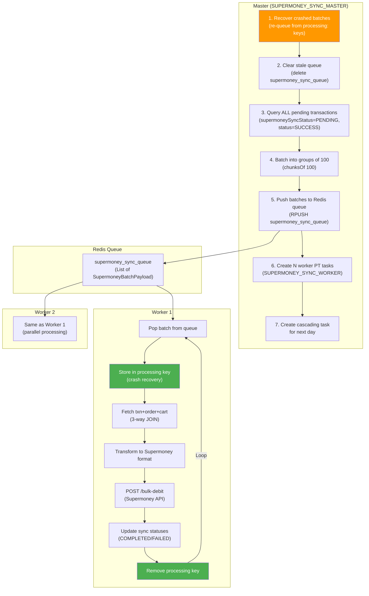

# Part 3 — Distributed Systems, Reliability & Performance

> Covers **Phase 6** (Distributed Systems & Reliability) and **Phase 7** (Performance & Scalability)

---

## 1. ProcessTracker — The Distributed Task Scheduler

> Source: [14-process-tracker.md](file:///Users/pratik.giramkar/Breeze/vayu/plan/14-process-tracker.md), [Producer.hs](file:///Users/pratik.giramkar/Breeze/vayu/src/Vayu/Product/ProcessTracker/Producer.hs), [Consumer.hs](file:///Users/pratik.giramkar/Breeze/vayu/src/Vayu/Product/ProcessTracker/Consumer.hs)

ProcessTracker (PT) is the most important distributed systems component. It manages **all** async workflows: order status polling, platform order creation, abandoned cart notifications, analytics, product sync, and more.

### Architecture

```
┌──────────────────────────────────────────────────────────────────┐
│  ProcessTracker Table (PostgreSQL)                                │
│  id | runner | retryCount | scheduleTime | trackingData | status  │
└──────┬──────────────────────────────────────────────┬────────────┘
       │ SELECT WHERE status IN (NEW, PENDING)         │ UPDATE
       │ AND scheduleTime IN [lowerLimit, upperLimit]   │
       ▼                                                │
┌───────────────┐   HTTP POST to consumer endpoint     │
│  PRODUCER      │ ─────────────────────────────────►   │
│  (own pod)     │   ProcessTrackerBatch { ptList }    │
│                │                           ┌─────────┴──────┐
│  Redis lock:   │                           │  CONSUMER       │
│  PRODUCER_LOCK │                           │  (API pods)     │
└───────────────┘                           │  Per-task:      │
                                             │  1. Redis lock  │
                                             │  2. runWorkflow │
                                             │  3. Update PT   │
                                             └────────────────┘
```

### Deployment Model

```
Same binary, two modes:

ENABLE_PROCESS_TRACKER=true  → Producer mode (infinite loop, NO HTTP server)
ENABLE_PROCESS_TRACKER=false → Consumer/API mode (HTTP server)

Producer calls Consumer via HTTP through the load balancer.
This enables horizontal scaling of consumers independently.
```

### Producer Algorithm

```python
# Pseudocode for Producer loop
while True:
    if SIGTERM received:
        graceful_shutdown()  # wait 1.8s then SIGKILL

    acquire_redis_lock("PRODUCER_LOCK", ttl=1000s)
    if not acquired:
        sleep(10s)
        continue

    upper_limit = now - SCHEDULER_LOWER_LIMIT     # default: 0s
    lower_limit = now - (SCHEDULER_LOWER_LIMIT + SCHEDULER_UPPER_LIMIT)  # default: 1800s

    tasks = SELECT * FROM processTracker
            WHERE status IN ('NEW', 'PENDING')
            AND scheduleTime BETWEEN lower_limit AND upper_limit

    for batch in chunk(tasks, PRODUCER_BATCH_SIZE=5):
        POST {consumer_url}/process-tracker/consumer
             body: { ptList: batch }

    release_redis_lock("PRODUCER_LOCK")
    sleep(SCHEDULER_SLEEP_TIME=10000ms)
```

### Consumer Algorithm

```python
# Pseudocode for Consumer handler
def consumer(batch):
    for task in batch.ptList:
        cartId = task.trackingData.cartId
        session = resolve_session(cartId)

        spawn_thread(session):
            acquired = redis.SET_NX("pt:consumer:{task.id}", ttl=150s)
            if not acquired:
                skip  # another consumer already processing

            try:
                UPDATE task SET status = PROCESS_STARTED
                response = runWorkflow(task)  # dispatch by runner enum
                UPDATE task SET status = response.ptState,
                                retryCount += 1,
                                scheduleTime += response.timeOffset
                if response.cascadingTask:
                    INSERT cascadingTask
            except:
                UPDATE task SET status = PENDING, scheduleTime += 200s
            finally:
                redis.DELETE("pt:consumer:{task.id}")

    return { status: SUCCESS }
```

### Why This Design?

| Decision | Why | Tradeoff |
|----------|-----|----------|
| PostgreSQL as task store | No additional infrastructure needed, ACID guarantees | Not as fast as dedicated message queue |
| Producer-Consumer split | Producers and consumers scale independently | Extra HTTP hop between them |
| Redis locks (not DB locks) | Fast, non-blocking, auto-expiring | Redis failure = potential duplicate execution |
| Sliding time window | Natural cleanup of old tasks | Tasks with very long backoff may fall outside window |
| HTTP between producer and consumer | Uses existing load balancer for distribution | Batch delivery is fire-and-forget (no acknowledgment) |

### Registered Workflows (21 active + 2 unsupported)

| Category | Workflows | Count |
|----------|-----------|-------|
| **Order** | OrderStatusCheck, PlatformOrderCreation, PaymentLinkGenerate | 3 |
| **Abandonment** | AbandonmentCheckout, AbandonmentVerification, BulkAbandonment | 3 |
| **Analytics** | LighthouseMetrics, RollupPopulate, LangfuseEvaluation | 3 |
| **Rollup Backfill** | Master, Analysis, Worker, Observability | 4 |
| **Campaign** | ResumeCampaign, RecurringCampaign | 2 |
| **Wallet Export** | ChunkWorkflow, MasterWorkflow | 2 |
| **Supermoney** | SyncMaster, SyncWorker | 2 |
| **Other** | ProductSync, BreezeBuddyCronJob, AgenticLoop | 3 |
| **Legacy** | OrderSync, NotificationSync → CANCELLED | 2 |

---

## 2. Master-Worker Pattern (Supermoney Sync — Your Work)

> Source: [MasterWorkflow.hs](file:///Users/pratik.giramkar/Breeze/vayu/src/Vayu/Product/Supermoney/MasterWorkflow.hs), [WorkerWorkflow.hs](file:///Users/pratik.giramkar/Breeze/vayu/src/Vayu/Product/Supermoney/WorkerWorkflow.hs)

This is a **textbook distributed batch processing pipeline** built on ProcessTracker. You designed and implemented this.

### Architecture



### Crash Recovery Design (Key Innovation)

The most important reliability feature you built:

```
BEFORE processing:
  1. SET processing:{queue}:{batchId} = batch (TTL: 3600s)
  2. ADD batchId to processing:{queue}:tracking list

Process the batch...

AFTER processing:
  3. DELETE processing:{queue}:{batchId}
  4. REMOVE batchId from tracking list

ON NEXT MASTER RUN (crash recovery):
  1. Read processing:{queue}:tracking list
  2. For each tracked batchId:
     - GET processing:{queue}:{batchId}
     - If exists: re-queue the batch → RPUSH to queue
     - DELETE the processing key
  3. DELETE tracking key
```

**Why this works**: If the worker crashes mid-batch, the `processing:` key survives (TTL: 1 hour). Next master run detects it and re-queues. No data loss.

### Retry Strategy (Two-attempt with email alerting)

```
Attempt 1: Process batch
  ├── DB fetch failure → re-queue with attempt=2
  ├── API failure → re-queue with attempt=2
  └── Individual txn failures → re-queue failed subset with attempt=2

Attempt 2: Process batch
  ├── DB fetch failure → mark FAILED + send email alert (CSV attachment)
  ├── API failure → mark FAILED + send email alert (CSV attachment)
  └── Individual txn failures → send email alert (no re-queue)
```

### Transaction Data Transformation

```haskell
-- WorkerWorkflow.hs:227-248
toSupermoneyTransaction (txn, order, cart) =
  SupermoneyDebitTransaction
    { partner_order_id    = Order._id order
    , platform_order_id   = fromMaybe "N/A" (Order._platformOrderId order)
    , partner_merchant_id = fromMaybe "N/A" (Order._merchantId order)
    , transaction_type    = "ORDER_PLACEMENT"
    , timestamp           = iso8601 (Transaction._createdAt txn)
    , order_amount        = Cart._totalPrice cart
    , currency            = Transaction._currency txn
    , payment_mode        = derivePaymentMode txn cart    -- COD/PREPAID/PARTIAL
    , prepaid_amount      = ...
    , cod_amount          = ...
    , payment_method_type = Transaction._paymentMethodType txn
    , payment_gateway     = derivePaymentGateway txn
    }
```

---

## 3. Distributed Locking Analysis

### Three-Level Lock Hierarchy

```
Level 1: PRODUCER LOCK
  Key:     PRODUCER_LOCK (configurable)
  TTL:     1000 seconds
  Scope:   Entire producer process
  Purpose: Only ONE producer instance runs at a time
  Failure: Another instance becomes producer after TTL expires

Level 2: TASK LOCK
  Key:     pt:consumer:{taskId}
  TTL:     150 seconds
  Scope:   Individual PT task
  Purpose: Prevent parallel execution of same task
  Failure: Task silently skipped (retry on next producer cycle)

Level 3: WORKFLOW STATE LOCK
  Key:     state:cart:{cartId} or pt:recon-workflow:{cartId}
  TTL:     200 seconds
  Scope:   Domain entity (cart/order)
  Purpose: Prevent concurrent cart/order modifications
  Failure: Workflow returns PENDING with 300s offset (try later)
```

### Lock Implementation Pattern

All locks use the same Redis-based approach:

```haskell
-- SET key value NX EX ttl
-- Returns True if lock acquired, False if already held
setLock :: Text → Int → Flow Bool
setLock key ttl = setExNxRedis key "locked" ttl
```

### Potential Issues

| Issue | Risk | Mitigation |
|-------|------|------------|
| **Redis failure** | All locks lost → duplicate execution | PT tasks are idempotent (deterministic IDs prevent DB duplicates) |
| **Clock skew** | Producer time window drift | Window is 30 min wide — small clock diffs are absorbed |
| **Lock not released** | Crash between acquire and release | TTL auto-expires; bracket pattern ensures cleanup on exceptions |
| **Split brain** | Two producers with expired lock | Redis SETNX is atomic — only one can hold the lock |

---

## 4. Retry and Backoff Strategy

### Exponential Backoff (ProcessTracker)

```haskell
calculateTimeOffset config retryCount =
  (backoffFactor ^ (retryCount + 1)) * 60   -- seconds

-- With defaults (backoffFactor=2):
-- Retry 0: 2^1 × 60 =  120s  (2 min)
-- Retry 1: 2^2 × 60 =  240s  (4 min)
-- Retry 2: 2^3 × 60 =  480s  (8 min)
-- Retry 3: 2^4 × 60 =  960s  (16 min)
-- Retry 4: 2^5 × 60 = 1920s  (32 min)
```

### Per-Shop Retry Config

```json
{
  "orderReconConfig": {
    "orderStatusCheck": { "maxRetries": 5, "initialDelay": 5, "backoffFactor": 2 },
    "platformOrderCreation": { "maxRetries": 5, "initialDelay": 5, "backoffFactor": 2 },
    "abandonCheckout": { "maxRetries": 3, "initialDelay": 10, "backoffFactor": 2 }
  }
}
```

### Max Retry Termination

When `retryCount >= maxRetries`:
- Order status check → **auto-cancel order** + spawn abandonment checkout task
- Platform order creation → log failure + alert
- Supermoney sync → mark FAILED + send email with CSV attachment

---

## 5. Idempotency Mechanisms

### 5.1 ProcessTracker Task IDs

Deterministic IDs prevent scheduling duplicate tasks:

```
"ord_sts_wfl_{cartId}"           — at most one status check per cart
"abd_chk_wfl_{eventName}_{cartId}" — one abandonment per event per cart
"rollup_backfill_master"          — exactly one master (singleton)
```

DB unique constraint → INSERT fails silently for duplicates.

### 5.2 Consumer Redis Locks

`pt:consumer:{taskId}` prevents parallel execution. If two consumers receive the same task in a batch, only one acquires the lock.

### 5.3 Payment Deduplication

`checkInProgress` pattern ([Request.hs:83-84](file:///Users/pratik.giramkar/Breeze/vayu/src/Vayu/Middlewares/Request.hs#L83-L84)):

```haskell
checkInProgress keyPrefix identifier =
  RedisQuery.checkKeyRedis (keyPrefix <> identifier)
    >>= handleInProgressRequest
```

Sets a Redis key before processing, deletes after. Concurrent duplicate requests see the key and return "already in progress."

### 5.4 Supermoney Sync Status

`supermoneySyncStatus` field on Transaction prevents double-sync:
- `PENDING` → eligible for sync
- `COMPLETED` → already synced, skip
- `FAILED` → permanently failed, skip

---

## 6. Performance & Scalability

### 6.1 Caching Strategy

| Cache | Type | TTL | Invalidation |
|-------|------|-----|-------------|
| **Shop** | In-memory (LRU) | Config-driven | Redis Pub/Sub channel |
| **Merchant** | In-memory (LRU) | Config-driven | Redis Pub/Sub channel |
| **HighRiskPincodes** | In-memory (LRU) | Config-driven | Redis Pub/Sub channel |
| **GlobalConfig** | Redis | Persistent | Overwritten on API update |
| **Supermoney Auth Token** | Redis | `expiresIn - 60s` | Auto-expire + on-demand refresh |
| **Euler Offers** | Redis | `offerBasedLockingTTL` | Cart-scoped, TTL-based |
| **OTP Sessions** | Redis | `OTP_TTL_SECONDS` | Auto-expire |

### 6.2 Async Processing

Fire-and-forget patterns for non-critical side effects:

```haskell
-- Product/Cart/Main.hs (conceptual)
spawnThread $ CustomerIngestion.ingest customer  -- Background
spawnThread $ Campaign.triggerEvent cart           -- Background
spawnThread $ WebEngage.sendEvent eventData        -- Background
spawnThread $ Facebook.sendCAPIEvent eventData     -- Background
```

These run in separate Haskell threads (green threads). Failures are logged but don't affect the main response.

### 6.3 HTTP Client Management

Three HTTP managers with different timeout profiles:

| Manager | Timeout | Use Case |
|---------|---------|----------|
| `default` | 55 seconds | Standard external API calls |
| `mProxy` | 55 seconds | Calls routed via outbound proxy |
| `mLowLatencyManager` | Configurable (default 3s) | Quick API calls (e.g., auth validation) |

### 6.4 Database Query Optimization

**Batch operations** used in critical paths:

```haskell
-- Supermoney: batch status update (your code)
transactionBatchUpdateSyncStatus :: [Text] → SyncStatus → Flow (Either Error Int)
-- Updates all matching transaction IDs in one query
```

**Cursor-based pagination** in offer listing:

```haskell
-- OfferProvider/Service.hs
-- Sort by ID → apply offset + limit → stable pagination
```

### 6.5 Scaling Characteristics

| Component | Scales How | Bottleneck |
|-----------|-----------|------------|
| **API Pods** | Horizontal (add more pods) | PostgreSQL connection pool |
| **ProcessTracker Producer** | Single instance (Redis lock) | DB query for eligible tasks |
| **ProcessTracker Consumer** | Horizontal (via load balancer) | Task-level Redis locks |
| **Supermoney Workers** | Configurable (SUPERMONEY_WORKER_COUNT) | Redis queue throughput |
| **PostgreSQL** | Vertical (single instance) | Connection count, write throughput |
| **Redis** | Standalone or Cluster mode | Memory (for queues + locks) |

### 6.6 Identified Bottlenecks

1. **Single PostgreSQL**: No evidence of read replicas. All reads and writes go to one instance.
2. **Single Producer**: Only one PT producer runs at a time (by design). If it's slow, all async workflows slow down.
3. **Producer polling interval**: 10-second sleep between cycles means up to 10s delay before a new task is picked up.
4. **Synchronous platform calls**: Cart creation blocks on Shopify/WooCommerce API responses. A slow platform API increases p99 latency for all customers of that platform.
5. **Unbounded ProcessTracker table**: FINISHED/CANCELLED tasks are never deleted. Over time, the `WHERE status IN ('NEW', 'PENDING')` query scans more rows.

---

## 7. Graceful Shutdown

```
SIGTERM received
  │
  ├── Signal handler: put () into shutdownSignal MVar
  │
  ├── Producer loop:
  │   ├── Check MVar on each iteration
  │   ├── If signaled:
  │   │   ├── threadDelay(GRACEFUL_SHUTDOWN_MS = 1800ms)
  │   │   └── raiseSignal SIGKILL (force exit)
  │   └── In-flight HTTP batch delivery completes
  │
  ├── Consumer tasks:
  │   └── Redis locks auto-expire via TTL
  │       → Tasks will be re-picked by next producer cycle
  │
  └── Kafka producer:
      └── Flushed in bracket cleanup (App.hs:200-204)
```

---

## 8. Enum Resilience During Deployments

**Problem**: During rolling deployments, different pods may have different `RunnerEnum` values. A new pod writes a task with a new runner; an old pod tries to read it and fails to parse.

**Solution** ([Queries.hs](file:///Users/pratik.giramkar/Breeze/vayu/src/Vayu/Services/Internal/ProcessTracker/Queries.hs)):

```
Attempt 1: SELECT * FROM processTracker WHERE status IN ('NEW', 'PENDING') ...
  ├── Success → return tasks
  └── Parse failure (unknown enum):
        ├── Log alert: "UNKNOWN_RUNNER_ENUM_DETECTED"
        └── Attempt 2: SELECT with WHERE runner IN ('ORDER_STATUS_CHECK_WORKFLOW', ...)
            → Only known RunnerEnum values (graceful degradation)
```

This enables **zero-downtime deployments** — old pods ignore new task types, new pods process everything.

> [!TIP]
> **For interviews**: "We had a real challenge with enum compatibility during rolling deployments. Our solution was a two-step query: try without filtering first, and if the ORM fails to parse an unknown enum, fall back to a query that only fetches known types. This gave us zero-downtime deployments without coordinating deployment order."

---

## 9. Failure Modes & Recovery

| Failure | Impact | Recovery |
|---------|--------|----------|
| **API pod crash** | In-flight requests fail | Load balancer routes to healthy pods. PT task locks auto-expire. |
| **Producer crash** | New async tasks not processed | Redis lock expires (1000s). Next producer instance takes over. |
| **Consumer crash mid-task** | Task stuck in PROCESS_STARTED | Consumer lock expires (150s). Producer re-fetches as PROCESS_STARTED → PENDING. |
| **Redis failure** | All locks lost, caching fails | PT falls back to DB-only (no dedup). OTP fails. Auth token cache miss → re-fetch. |
| **PostgreSQL failure** | Complete outage | No application-level recovery. Relies on infrastructure (replicas, failover). |
| **External API failure** | Platform order creation fails | PT retry with exponential backoff. After max retries → alert. |
| **Supermoney API failure** | Batch sync fails | Worker re-queues batch with incremented attempt. After 2 attempts → email alert with CSV. |
