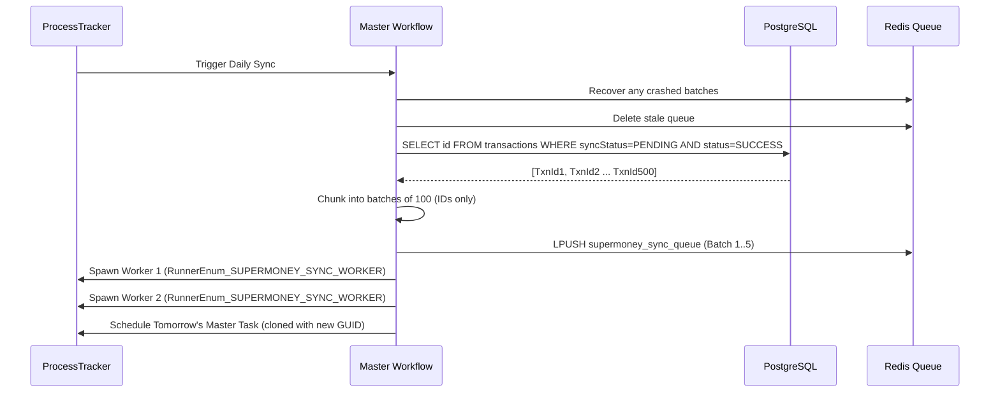

# Supermoney Order Reconciliation Pipeline (Deep-Dive)

This document is a comprehensive, code-verified analysis of the Supermoney Order Reconciliation pipeline within the Vayu backend. Every claim is verified against the source code. Where something could not be confirmed, it is explicitly marked.

---

## 1. Architecture Overview

### 1.1 What Supermoney Is (Business Context)

Supermoney is a financial partner that provides wallet and lending services to Breeze merchants. After a customer completes a checkout via Breeze, Vayu must report these successful transactions to Supermoney's ledger so Supermoney can debit the appropriate merchant wallet.

### 1.2 Why a Pipeline Was Needed

Doing this synchronously (one API call per order at checkout time) would add latency to the checkout flow and couple it to Supermoney's availability. Instead, the system uses an **asynchronous, batch-oriented Master-Worker pipeline** that runs daily, decoupled from real-time checkout.

### 1.3 Module Structure (Confirmed from code)

The Supermoney integration spans **two layers** and **six files**:

| Layer | Module | Responsibility |
|---|---|---|
| **Product** | `Product/Supermoney/Main.hs` | Product-layer API handlers (wallet balance, ledger, load, invoices). Not part of the reconciliation pipeline. |
| **Product** | `Product/Supermoney/MasterWorkflow.hs` | Master: queries DB, batches, queues, spawns workers, schedules next run. |
| **Product** | `Product/Supermoney/WorkerWorkflow.hs` | Worker: dequeues, hydrates, transforms, calls API, reconciles, alerts. |
| **External** | `Services/External/Supermoney/Auth.hs` | OAuth 2.0 client credentials flow. Token fetch, encryption, Redis caching. |
| **External** | `Services/External/Supermoney/Main.hs` | Service layer wrapping all Supermoney API calls (`bulkDebit`, `getWalletBalance`, etc.). |
| **External** | `Services/External/Supermoney/Types.hs` | Servant API type definitions for auth and wallet endpoints. |

Additionally:
- `Services/Internal/Transaction/Queries.hs` — Custom Beam queries (3-way JOIN, batch status updates).
- `Generated/NetworkCalls/SupermoneyWalletService.hs` — Generated network call for the bulk debit API endpoint.
- `Product/ProcessTracker/Workflows.hs` — Registers `RunnerEnum_SUPERMONEY_SYNC_MASTER` and `RunnerEnum_SUPERMONEY_SYNC_WORKER`.

### 1.4 Key Technologies Used (Confirmed)
1. **ProcessTracker (PT)**: Database-backed distributed task scheduler. Both Master and Worker are PT tasks.
2. **PostgreSQL**: Stores transactions with `supermoneySyncStatus` (`PENDING` | `COMPLETED` | `FAILED`).
3. **Redis**: Used as an in-memory work queue (`supermoney_sync_queue`) and for crash-recovery tracking keys.
4. **Cassava**: Haskell CSV library. Orphan instances encode `SupermoneyDebitTransaction` to CSV for email attachments.
5. **AWS SES (via `VayuAwsEmailForwarding`)**: Sends HTML alert emails with CSV attachments on failure.
6. **OAuth 2.0**: Supermoney API authentication uses client credentials flow with encrypted token caching in Redis.

---

## 2. Authentication (`Auth.hs`)

> [!IMPORTANT]
> The original document completely missed the authentication layer. This is a critical component.

### 2.1 OAuth 2.0 Client Credentials Flow

Every Supermoney API call (including `bulkDebit`) requires a valid OAuth access token. The flow:

1. **`ensureValidAuthTokenIsCached`** is the entry point. Called before every API call.
2. It reads the Redis key `supermoney:{clientId}:auth_token`.
3. **If token exists**: Returns immediately (cache hit).
4. **If token is missing (or expired)**: Calls `fetchAndStoreFreshToken`:
   - Reads `clientId` and `clientSecret` from environment config (`FlowMonad.getSupermoneyClientId`, `FlowMonad.getSupermoneyClientSecret`).
   - Calls `POST /supercheckout/v1/client/oauth/token` with the credentials.
   - On success: Base64 encodes the response, encrypts it using `KeyStore.encrypt`, and stores it in Redis.
   - **How Expiration Works:** The application does not manually check timestamps. Instead, it reads the `expiresIn` field from the API response and sets the Redis key's **TTL (Time To Live)** to `(expiresIn - 60 seconds)`. The 60-second buffer ensures the token is refreshed before it actually expires. Because Redis automatically deletes the key when the TTL hits zero, an expired token simply manifests as a "missing" token (a cache miss).
5. **Corruption handling**: If `readAndDecryptTokenFromRedis` fails to Base64-decode a cached token, it deletes the corrupted key from Redis and returns `Nothing`, triggering a fresh fetch on the next call.

### 2.2 Security Details (Confirmed)
- Tokens are **encrypted at rest** in Redis using `KeyStore.encrypt`/`KeyStore.decrypt`.
- The Redis key is scoped per `clientId` (`supermoney:{clientId}:auth_token`), supporting multiple Supermoney clients.
- The `clientSecret` is read from environment config (not hardcoded).

---

## 3. The Master Workflow (`MasterWorkflow.hs`)

The Master workflow (`RunnerEnum_SUPERMONEY_SYNC_MASTER`) runs once per day. It acts as the coordinator and batch creator.

### 3.1 Execution Flow (Verified step-by-step against code):

1. **Crash Recovery**: First, calls `recoverProcessingBatches` (see Section 5.1). This re-queues any batches that were in-flight when a previous worker crashed.
2. **Stale Queue Cleanup**: Deletes the Redis queue key (`supermoney_sync_queue`) to ensure a clean slate.
3. **Bulk Query**: Queries PostgreSQL for ALL transaction **IDs** where `supermoneySyncStatus = PENDING` AND `status = SUCCESS`. 
   - **Important detail**: The query fetches only IDs (not full records) via `transactionFindPendingIdsForSync`. This is a deliberate memory optimization — if there are 50,000 pending transactions, you don't want to load 50,000 full transaction objects into memory.
   - **Important detail**: There is no time filter. The query relies entirely on the `syncStatus` lifecycle (`PENDING` → `COMPLETED`/`FAILED`). This makes the Master idempotent: if it fails to run on Tuesday, Wednesday's run picks up everything.
4. **Batching**: Chunks the ID list into arrays of **100** using a custom `chunksOf` function.
5. **Queueing**: Creates a `SupermoneyBatchPayload` for each chunk (with `batchId` = sequential index, `attempt` = 1) and pushes it to the Redis queue.
6. **Worker Spawning**: Reads `SUPERMONEY_WORKER_COUNT` from environment config (via `FlowMonad.getSupermoneyWorkerCount`) and spawns that many concurrent `RunnerEnum_SUPERMONEY_SYNC_WORKER` ProcessTracker tasks.
7. **Self-Scheduling**: Creates a cascading PT task scheduled 24 hours later (via `createNextDayTask`) by cloning the current task with a new GUID, `status = NEW`, and `scheduleTime = now + 86400 seconds`.

---

## 4. The Worker Workflow (`WorkerWorkflow.hs`)

Workers are spawned by the Master as concurrent ProcessTracker tasks. They compete to consume batches from the shared Redis queue.

### 4.1 Processing Loop (Verified):

The worker runs a recursive loop (`processBatches`) until the queue is empty:

1. **Dequeue**: Pops a `SupermoneyBatchPayload` from the Redis queue.
2. **Crash-Safety Checkpoint**: Before processing, stores the batch in a Redis processing key (`processing:supermoney_sync_queue:{batchId}`) with a 1-hour TTL. Also adds the `batchId` to a Redis tracking list (`processing:supermoney_sync_queue:tracking`).
3. **Data Hydration**: Calls `TransactionQueries.transactionFindWithOrderByIds` which performs a **3-way Beam JOIN** across `transactions`, `orders`, and `carts` tables, filtered by the batch's transaction IDs. This fetches pricing, merchant IDs, payment methods, and gateway info in a single query.
4. **Transformation**: Maps each `(Transaction, Order, Cart)` tuple into a `SupermoneyDebitTransaction` via `toSupermoneyTransaction`. Key fields derived:
   - `partner_order_id` = Vayu Order ID
   - `platform_order_id` = Magento/Shopify Order ID (or `"N/A"`)
   - `partner_merchant_id` = Merchant ID from Order (or `"N/A"`)
   - `order_amount` = `Cart.totalPrice`
   - `payment_mode` / `prepaid_amount` / `cod_amount` = Derived by `derivePaymentMode`
   - `payment_gateway` = `Transaction.gateway` (or `"CASH"` for COD)
   - `timestamp` = ISO 8601 formatted `Transaction.createdAt`
5. **Authentication**: `SupermoneyService.bulkDebit` internally calls `Auth.ensureValidAuthTokenIsCached`, then reads the decrypted token from Redis before making the API call.
6. **API Call**: `POST /supercheckout/v1/wallet/txn/bulk` with the `access-token` header and `SupermoneyDebitBulkRequest` body.
7. **Status Reconciliation**: Parses the per-transaction results from the API response. Uses `partitionTransactionsByStatus` to group transactions by `COMPLETED` vs `FAILED`, then performs **batch SQL updates** via `transactionBatchUpdateSyncStatus` (a single `UPDATE ... WHERE id IN (...)` per status).
8. **Failure Handling**: Delegates to `checkForIndividualFailures` (see Section 5.2).
9. **Cleanup**: Deletes the processing key and removes the `batchId` from the tracking list.
10. **Recurse**: Calls `processBatches` again to process the next batch.

### 4.2 Payment Mode Derivation (`derivePaymentMode`) (Confirmed)

| Cart State | Result |
|---|---|
| `amountPaid` exists AND `partialPaymentRuleId` exists | `("PARTIAL_PAYMENT", amountPaid, totalPrice - amountPaid)` |
| `paymentMethodType == "CASH"` | `("COD", 0, totalPrice)` |
| All other cases | `("PREPAID", totalPrice, 0)` |

### 4.3 Payment Gateway Derivation (`derivePaymentGateway`) (Confirmed)
- If `paymentMethodType == "CASH"` → returns `"CASH"`
- Otherwise → returns `Transaction.gateway` (e.g., `"JUSPAY"`, `"RAZORPAY"`), defaulting to `"UNKNOWN"` if `Nothing`.

---

## 5. Reliability, Failure Handling & Crash Recovery

### 5.1 Crash Recovery (The Tracking + Processing Key Pattern)

**Problem**: If a worker pod crashes mid-processing, the batch it popped is lost from the queue.

**Solution** (Confirmed from `MasterWorkflow.hs:178-206` and `WorkerWorkflow.hs:157-179`):

The system uses a **two-key pattern** to solve this, utilizing two different Redis data structures:
1. **Processing Key (Redis String)** (`processing:supermoney_sync_queue:{batchId}`): This stores the actual, heavy JSON payload of the batch (the `SupermoneyBatchPayload`). It acts as a temporary safe-haven for the data while it is being processed and has a 1-hour TTL.
2. **Tracking List (Redis List)** (`processing:supermoney_sync_queue:tracking`): This is simply an array of integers (e.g., `[123, 124, 125]`). It acts as a master index of all `batchId`s currently in-flight across all workers.

**Worker lifecycle**:
- Before processing: Worker writes the batch to the processing key AND adds `batchId` to the tracking list.
- After success: Worker deletes the processing key AND removes `batchId` from the tracking list.

**Recovery** (runs at the start of the next Master execution):
- `recoverProcessingBatches` reads the tracking list to find all in-flight batch IDs.
- For each batch ID, it reads the batch payload from the processing key.
- If the payload exists, it re-queues it to the main queue and deletes the processing key.
- Finally, it deletes the tracking list.

> [!NOTE]
> The tracking list is necessary because Redis does not support pattern-scanning atomically. Without it, the Master would need to `SCAN` for `processing:*` keys, which is less reliable. The tracking list provides an explicit manifest of in-flight work.

### 5.2 Retry Logic (Max 2 Attempts)

The retry mechanism is **not** exponential backoff. It is a simple **max 2 attempts** system tracked via the `attempt` field in `SupermoneyBatchPayload`.

Three failure scenarios are handled, each with the same retry-then-alert pattern:

#### Scenario A: Database Fetch Failure (`handleFetchFailure`)
- **Cause**: The 3-way JOIN query fails (DB connectivity, schema issues).
- **Attempt 1**: Re-queues the batch with `attempt + 1`.
- **Attempt ≥ 2**: Marks all transactions as `FAILED`. Sends `FetchFailedAlert` email (no CSV attachment, since no transaction data was fetched).

#### Scenario B: Whole API Failure (`handleAPIFailure`)
- **Cause**: The Supermoney bulk debit API returns a 500, 4xx, or network timeout.
- **Attempt 1**: Re-queues the batch with `attempt + 1`.
- **Attempt ≥ 2**: Marks all transactions as `FAILED`. Sends `WholeBatchFailedAlert` email **with CSV attachment** of the failed transactions.

#### Scenario C: Individual Transaction Failures (`checkForIndividualFailures`)
- **Cause**: The API call succeeded overall, but individual transactions within the response have `status != "SUCCESS"`.
- **Attempt 1**: Creates a **new retry batch** containing only the failed transaction IDs (with `batchId = originalBatchId + 10000` to avoid collisions, `attempt = 2`), and pushes it back to the queue.
- **Attempt ≥ 2**: Does NOT re-queue. Sends `IndividualTransactionsFailedAlert` email **with CSV attachment** of only the failed transactions.

> [!IMPORTANT]
> The successful transactions from the same batch are NOT retried. The `updateTransactionStatuses` function runs *before* `checkForIndividualFailures`, so successful transactions are already marked `COMPLETED` in the database before the retry batch is created.

### 5.3 Automated Alerting & CSV Generation (Confirmed)

Three distinct alert types with different HTML templates:

| Alert Type | Subject Line | CSV Attached? | When Triggered |
|---|---|---|---|
| `WholeBatchFailedAlert` | "Supermoney Sync FAILED - Whole Batch Failure" | Yes (all transactions in batch) | API call fails after 2 attempts |
| `IndividualTransactionsFailedAlert` | "Supermoney Sync - Individual Transaction Failures" | Yes (only failed transactions) | Individual transactions rejected after 2 attempts |
| `FetchFailedAlert` | "Supermoney Sync FAILED - Database Fetch Error" | No (no data available) | DB query fails after 2 attempts |

**Email delivery** (Confirmed from `sendEmailAlert`):
- Recipients are read from config: `supermoneyAlertEmails` (sourced from `SUPERMONEY_ALERT_EMAILS` environment variable).
- If no recipients are configured, it logs a failure but does not crash.
- Emails are sent via `VayuAwsEmail.forwardEmailToVayuAws` using a `vayuAwsWriteAuthToken` Bearer token.
- CSV files are generated in-memory using Cassava's `encodeDefaultOrderedByName`, Base64 encoded, and attached as `failed_transactions.csv`.

---

## 6. Challenges Faced & Solved

### Challenge 1: Memory Efficiency at Scale

**Problem**: If there are 100,000 pending transactions, loading all full records into the Master's memory would cause OOM kills.

**Solution** (Confirmed): The Master fetches only transaction **IDs** (`transactionFindPendingIdsForSync` returns `[Text]`, not `[Transaction]`). The full data hydration happens in the Worker, scoped to batches of 100. This bounds memory usage per Worker to ~100 transaction records at a time.

### Challenge 2: Preventing Duplicate Syncs

**Problem**: If the pipeline runs twice (e.g., Master restarts), it could send the same transactions to Supermoney again.

**Solution** (Confirmed): The `supermoneySyncStatus` field acts as a state machine:
- `PENDING` → eligible for sync.
- `COMPLETED` → successfully synced; the Master's query (`WHERE syncStatus = PENDING`) will never pick it up again.
- `FAILED` → permanently failed; also excluded from future runs.

The status is updated **within the same worker execution** that calls the API, so there is no window where a transaction could be picked up twice (unless the worker crashes between the API call and the DB update — see Challenge 3).

### Challenge 3: At-Least-Once vs. Exactly-Once Delivery

**Problem**: If a worker successfully calls the Supermoney API but crashes before updating the database status to `COMPLETED`, the crash recovery mechanism will re-queue the batch, causing duplicate submissions.

**Trade-off acknowledged**: The system provides **at-least-once** delivery, not exactly-once. Supermoney's API is expected to handle duplicate submissions idempotently (e.g., by rejecting a `partner_order_id` it has already processed).

> [!WARNING]
> *Cannot be confirmed from the repository*: Whether Supermoney's API actually enforces idempotency on `partner_order_id`. If it does not, the crash recovery mechanism could cause duplicate debits. This is a limitation of the current design.

### Challenge 4: Decoupled Scheduling Without External Cron

**Problem**: The pipeline needs to run daily, but Vayu doesn't use an external scheduler like Kubernetes CronJobs.

**Solution** (Confirmed): The Master uses a **cascading self-scheduling pattern**. At the end of every run, it creates a new ProcessTracker task scheduled 24 hours later. This is a PT record in PostgreSQL, so it survives pod restarts. The chain only breaks if the Master fails *and* the cascading task was never written (which would require a crash between the last `return` and PT persistence — extremely unlikely given PT's design).

---

## 7. Interview Preparation (Director Level)

### Q1: "Walk me through the Supermoney reconciliation pipeline you built."
**What they are testing**: Ability to explain a complex distributed system concisely.
**Answer**: "Every day, a Master ProcessTracker task queries all successful transactions pending Supermoney sync. It fetches only the IDs for memory efficiency, chunks them into batches of 100, and pushes them to a Redis queue. It then spawns N concurrent Worker tasks. Each Worker pops a batch, performs a 3-way database JOIN to hydrate the full transaction, order, and cart data, transforms it into Supermoney's format, authenticates via OAuth 2.0, and calls their bulk debit API. The API response contains per-transaction results, so the Worker partitions them into completed and failed, and batch-updates the database accordingly."

### Q2: "Why did you use Redis as a queue instead of just having workers query the database directly?"
**What they are testing**: Understanding of work distribution and contention.
**Answer**: "If multiple workers queried the database directly, they'd all fetch the same set of pending transactions, leading to duplicate processing and contention. Redis gives us a proper work queue with atomic pop operations — each batch is consumed by exactly one worker. It also decouples the read-heavy Master phase from the write-heavy Worker phase. The Master does one bulk read, and Workers process independently without competing for database locks."

### Q3: "How did you handle a worker crashing mid-processing?"
**What they are testing**: Fault tolerance and at-least-once delivery.
**Answer**: "I implemented a crash recovery pattern using two Redis structures. Before processing a batch, the Worker stores the batch payload in a processing key and adds its batch ID to a tracking list. After successful processing, both are cleaned up. If a pod crashes, the next day's Master run calls `recoverProcessingBatches` first — it reads the tracking list, finds the orphaned batch payloads, re-queues them, and cleans up. This gives us at-least-once delivery. The trade-off is that if a worker crashes *after* the API call but *before* updating the database, the batch gets reprocessed, so we rely on Supermoney's API to handle duplicate `partner_order_id`s idempotently."

### Q4: "What happens when the Supermoney API partially fails — some transactions succeed, some fail?"
**What they are testing**: Granular error handling in batch systems.
**Answer**: "The API returns per-transaction results. The Worker first runs `updateTransactionStatuses`, which partitions all transactions into completed and failed groups and performs batch SQL updates for each. Then `checkForIndividualFailures` isolates the failed ones. On the first attempt, it creates a new retry batch containing only the failed transaction IDs and pushes it back to the queue. If the retry also fails, it generates a CSV of the failed transactions using the Cassava library, Base64 encodes it, and sends an automated email alert to the configured recipients via AWS SES. The successful transactions from the original batch are already marked as `COMPLETED` and are never retried."

### Q5: "What happens if the Master workflow fails to run one day?"
**What they are testing**: Idempotency and system resilience.
**Answer**: "The Master is fully idempotent. Its database query has no time filter — it selects all transactions where `syncStatus = PENDING` and `status = SUCCESS`. If the Master doesn't run on Tuesday, Wednesday's run picks up both Tuesday's and Wednesday's transactions. No data is lost. The only risk is increased latency in reporting to Supermoney, but correctness is preserved."

### Q6: "How does the authentication work for the Supermoney API?"
**What they are testing**: Security awareness and token management.
**Answer**: "We use OAuth 2.0 client credentials flow. Before every API call, we check Redis for a cached token. If it's missing or expired, we fetch a fresh one from Supermoney's `/oauth/token` endpoint using our `clientId` and `clientSecret`. The token is Base64 encoded, encrypted using our KeyStore service, and stored in Redis with a TTL that's 60 seconds shorter than the actual token expiry — this buffer ensures we refresh before expiration rather than discovering an expired token during an API call. If a cached token fails to decrypt (corruption), we delete it and fetch fresh."

### Q7: "What are the limitations of this design? What would you improve?"
**What they are testing**: Architectural maturity and self-awareness.
**Answer**: "Three things. First, the crash recovery only runs at the start of the next Master execution, which means a crashed batch sits unprocessed until the next day. I'd improve this by having a separate, more frequent health-check task that monitors the tracking list. Second, the retry logic is capped at 2 attempts with no backoff — for transient API issues, exponential backoff would be more resilient. Third, the system provides at-least-once delivery, not exactly-once. If Supermoney's API doesn't enforce idempotency on `partner_order_id`, we could have duplicate debits after a crash. I'd add a local deduplication check before retrying — query our own database first to see if the transaction was already marked `COMPLETED`."

### Q8: "How do multiple workers avoid processing the same batch?"
**What they are testing**: Concurrency and distributed coordination.
**Answer**: "Redis's `RPOP` (or equivalent pop operation) is atomic. When two workers try to pop from the queue simultaneously, Redis guarantees each batch is returned to exactly one consumer. There's no application-level locking needed because the queue itself provides mutual exclusion. This is one of the key reasons we chose Redis as the queue — it gives us concurrent-safe work distribution for free."

---

## 8. Final Mental Model

**Memorize this paragraph:**
> "For the Supermoney integration, I designed a distributed Master-Worker reconciliation pipeline. The Master runs daily via ProcessTracker, queries all pending successful transactions (IDs only for memory efficiency), chunks them into batches of 100, pushes them to a Redis queue, and spawns concurrent Workers. Each Worker pops a batch, performs a 3-way database JOIN to hydrate the data, authenticates via OAuth 2.0, and calls Supermoney's bulk debit API. Results are reconciled per-transaction: successes are marked `COMPLETED`, failures get one automatic retry, and persistent failures trigger an automated CSV-attached email alert. Crash safety is ensured through Redis processing keys and a tracking list that the next Master run uses to recover any in-flight batches."
